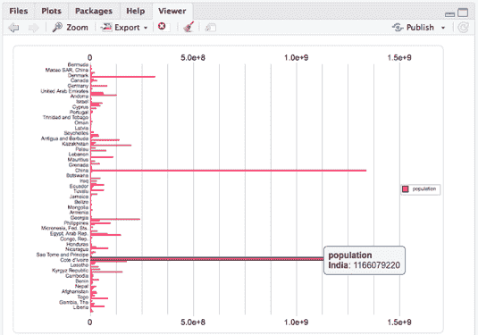
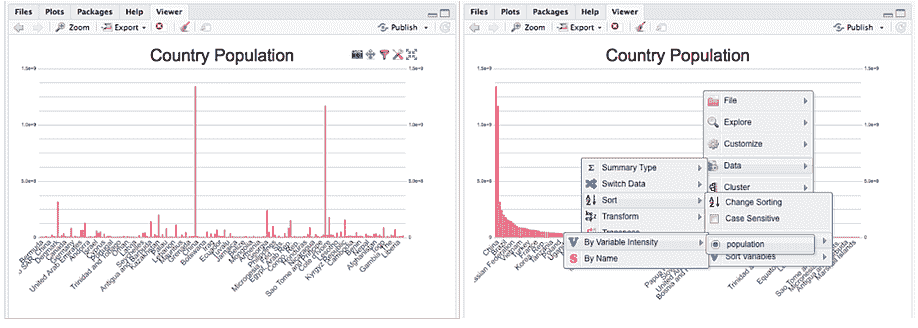
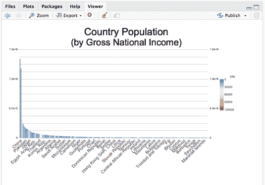
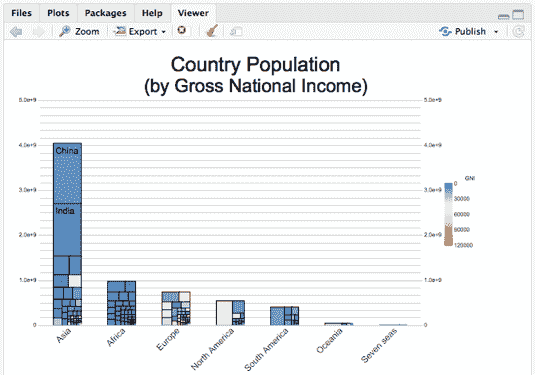

# canvasXpress 中的大型可视化

> 原文：<https://www.dominodatalab.com/blog/large-visualizations-canvasxpress>

*<small>[康尼布雷特博士](https://www.linkedin.com/in/conniebprofile/)是[聚合天才](http://www.aggregate-genius.com/)的拥有者。Connie Brett 博士为 Bristol-Myers Squibb 的转化生物信息学团队提供定制可视化工具开发和支持，同时也是 canvasXpress 的 [CRAN 软件包的维护者。该团队开发和支持包括 canvasXpress 在内的工具，以帮助打破科学研究和开发的障碍。如果你对此感兴趣，可以考虑](https://cran.r-project.org/web/packages/canvasXpress/index.html)[加入团队](https://www.bms.com/job-seekers/job-search-results.html?country=united%20states%20of%20america&keyword=translational%20bioinformatics)。</small>*

## canvasXpress 简介

每个人都有自己喜欢的数据可视化包——无论是 ggpot、plotly 还是其他任何一个。然而，一旦图表上有成千上万的可视化对象(例如，点)，经常遇到的一个问题是，那些常见的可视化工具将停滞不前，性能受到影响。但是，正如您可能已经听说的那样，有一个解决这个问题的软件包 canvasXpress。

CanvasXpress 是百时美施贵宝公司开发的生物信息学和系统生物学分析的核心可视化组件。在这个库中创建图表非常直观，通过简单的配置更改，您可以创建丰富的、可扩展的和可广泛移植的图表。该库支持大量的可视化类型，并在可视化上包括一组简单而不显眼的用户界面功能，允许用户缩放、过滤、转换、聚集、下载等等。该库由 Isaac Neuhaus 积极维护和开发，包括一个由我维护的完整文档化的配套 CRAN R 包。R 包将广泛的 API 选项包装到一个 htmlwidget 中——这意味着可以在 RStudio 中使用 canvasXpress 在控制台中生成绘图，或者将它们无缝嵌入到 RMarkdown 或 Shiny web 应用程序中。

在这篇文章中，我将带你从原始数据中创建和定制一个大图表，并把它放到 RMarkdown 或 Shiny 应用程序中。

## 数据注释

CanvasXpress 可轻松处理多维和大型数据集进行可视化。浏览器中的 canvasXpress 功能通常要求数据具有较宽的格式，并利用列名和行名来交叉引用和访问制作图表所需的各种数据，因此有必要花一点时间来定义 canvasXpress 中的一些常用术语。

**变量**是主数据框中的数据行，变量名取自行名。

**样本**是主数据框中的数据列，样本名称取自列名。

**注释**是额外的信息或特征。这些数据点增加了有关样本或变量的信息，但不是主数据集的一部分。注释可以出现在行(变量)或列(样本)或两者上。

## 建筑图

现在我们已经介绍了常用术语，让我们从头开始使用一个 R 函数调用在 canvasXpress 中构建图表。出于说明的目的，我们正在构建的图表基于来自世界银行的两个可下载数据集。虽然 canvasXpress 是为可视化生物数据而构建的，但它将适用于任何数据集主题。R 中的 canvasXpress 函数调用使用命名变量，因此选项的顺序并不重要——事实上，当您使用这个包时，您将开发自己喜欢的选项和顺序。当我们构建函数调用时，代码块将使用粗体指出变化。

首先，我们将数据读入两个 R 对象:y 和 x。y 对象将包含我们正在为每个国家构建的世界人口图表的主要数据集。这个数据集的样本是国家(列)，这个数据集中只有一个变量(行)——人口。第二个数据集被读入 x 对象，并将保存每个国家的样本注释或附加信息，如 GNI(国民总收入)。

我们对这些数据的第一次可视化非常简单——我们只想看到按国家划分的人口柱状图:

```py
y <- read.table("http://www.canvasxpress.org/data/cX-stacked1-dat.txt",

                header = TRUE, sep = "\t", quote = "", row.names = 1,

                fill = TRUE, check.names = FALSE, stringsAsFactors = FALSE)

x <- read.table("http://www.canvasxpress.org/data/cX-stacked1-smp.txt",

                header = TRUE, sep = "\t", quote = "", row.names = 1,

                fill = TRUE, check.names = FALSE, stringsAsFactors = FALSE)

library(canvasXpress)
canvasXpress(data = y, graphType = "Bar")
```



您已经拥有内置的工具提示和所有的 canvasXpress 工具栏功能(过滤、下载等。)除了你的条形图之外——并且在一个单独的调用中只指定 graphType。现在，让我们通过更改方向、添加标题、旋转标签和移除图表中的图例来改进这个条形图:

```py
canvasXpress(data             = y,

             graphType        = "Bar",

             graphOrientation = "vertical",

             title            = "Country Population",

             smpLabelRotate   = 45,

             showLegend       = FALSE)

```



在左侧截图中，您可以看到右上角的 canvasXpress 图表工具栏。该图表还有一个上下文菜单(右键单击),在右边的屏幕截图中用于选择数据排序所依据的变量。这些工具都不需要任何设置配置，并且是图表本身的一个功能-无论是托管在 RStudio 的视图窗格、闪亮的应用程序、RMarkdown 文档中，还是直接在 html 网页上。花几分钟时间探索这些丰富的工具，用于下载、过滤、格式化、更改图表类型、属性，甚至数据本身！

进入下一个图表级别很容易——将过渡直接添加到图表本身。下面的代码在图表中添加了一个排序转换——您必须尝试一下，因为屏幕截图是静态的！这些转换不仅执行某些功能(例如，对数据进行排序)，而且还可以为您的用户提供关于数据和图表如何操作的附加上下文。此外，他们还增加了一些眼睛糖果几乎没有你的工作！

```py
canvasXpress(data             = y,


             graphType        = "Bar",


             graphOrientation = "vertical",


             title            = "Country Population",


             smpLabelRotate   = 45,


             showLegend       = FALSE,


             sortDir          = "descending",


             showTransition   = TRUE,

afterRender      = list(list("sortSamplesByVariable",

                                     list("population")))) 
```

好了，现在我们对现有的数据有了一个概念，让我们用国民总收入给图表着色，让图表更有用。这是数据集中样本的“注释”或额外信息(如国家)。我们已经在 x 对象中加载了一个包含所有国家信息的数据集，让我们将它添加到 smpAnnot 中的图表中，并根据 GNI 进行着色。我们还将通过注释掉 showLegend = FALSE 行来重新打开图例，并向图表添加一个副标题来枚举数据集的添加。

```py
canvasXpress(data             = y,


             smpAnnot         = x,


             graphType        = "Bar",


             graphOrientation = "vertical",


             title            = "Country Population",

             smpLabelRotate   = 45,

             #showLegend      = FALSE,


             subtitle         = "(by Gross National Income)",


             colorBy          = list("GNI"),


             sortDir          = "descending",


             showTransition   = TRUE,


             afterRender      = list(list("sortSamplesByVariable",

                                     list("population"))))

```



最后，我想把各大洲的数据组合成一个堆叠的条形图，以便于阅读。如果把它显示成一个树形图而不是一个简单的堆叠条形图就太好了——它只有两个额外的选项:

```py
canvasXpress(data             = y,


             smpAnnot         = x,


             graphType        = "Stacked",


             graphOrientation = "vertical",


             title            = "Country Population",

             smpLabelRotate   = 45,

             #showLegend      = FALSE,


             subtitle         = "(by Gross National Income)",


             colorBy          = list("GNI"),


             treemapBy        = list("ISO3"),


             groupingFactors  = list("continent"),


             sortDir          = "descending",


             showTransition   = TRUE,


             afterRender      = list(list("sortSamplesByVariable",

                                     list("population"))))
```



现在，我的图表中有了一个非常丰富的数据集，包括工具提示、可视化转换和丰富的交互性。无论我在哪里部署此图表，我的用户都将获得每个 canvasXpress 图表内置的所有功能，以进行过滤、排序、缩放、平移、下载等，而无需编写任何额外代码，只需一次函数调用。我可以将这个图表的代码放入一个闪亮的应用程序或 RMarkdown 中任何可以使用 htmlwidget 的地方，图表的性能可以扩展到数万个数据点。

这是一个一页纸的闪亮应用程序，展示了这个图表——ui 调用中的一个***CanvasXpress output***与服务器调用中的一个***renderCanvasXpress***reactive 配对，该服务器调用包含我们上面创建的完全相同的 canvasXpress 函数调用:

```py
library(shiny)

library(canvasXpress)

ui <- fluidPage(

    flowLayout(canvasXpressOutput("exampleChart", width = "800px"))

)

server <- function(input, output) {

    y <- read.table("http://www.canvasxpress.org/data/cX-stacked1-dat.txt",

                    header = TRUE, sep = "\t", quote = "", row.names = 1,

                    fill = TRUE, check.names = FALSE, stringsAsFactors = FALSE)

    x <- read.table("http://www.canvasxpress.org/data/cX-stacked1-smp.txt",

                    header = TRUE, sep = "\t", quote = "", row.names = 1,

                    fill = TRUE, check.names = FALSE, stringsAsFactors = FALSE)

    output$exampleChart <- renderCanvasXpress({

        canvasXpress(data             = y,

                     smpAnnot         = x,

                     graphType        = "Stacked",

                     graphOrientation = "vertical",

                     title            = "Country Population",

                     smpLabelRotate   = 45,

                     #showLegend      = FALSE,

                     subtitle         = "(by Gross National Income)",

                     colorBy          = list("GNI"),

                     treemapBy        = list("ISO3"),

                     groupingFactors  = list("continent"),

                     sortDir          = "descending",

                     showTransition   = TRUE,

                     afterRender      = list(list("sortSamplesByVariable",

                                                  list("population"))))

    })

}

shinyApp(ui = ui, server = server)
```

## 总结

canvasXpress 网站在网站的示例部分有数十种类型的数百个图表的 R 代码。您可以将 R 代码复制/粘贴到 RStudio 的控制台中，并创建图表，探索数据是如何设置的，以及各种定制选项等。这是熟悉您感兴趣的确切图表类型的好方法！此外，在 Shiny 中有三个使用 canvasXpress 可视化的预构建示例应用程序，您可以使用 cxShinyExample()函数启动它们。通过使用广泛的 API 选项(在网站上也有详细介绍)进行简单的配置更改，您的图表可以是丰富的、可伸缩的和广泛可移植的。