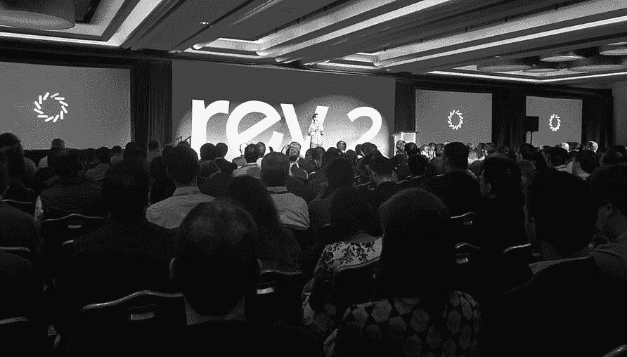
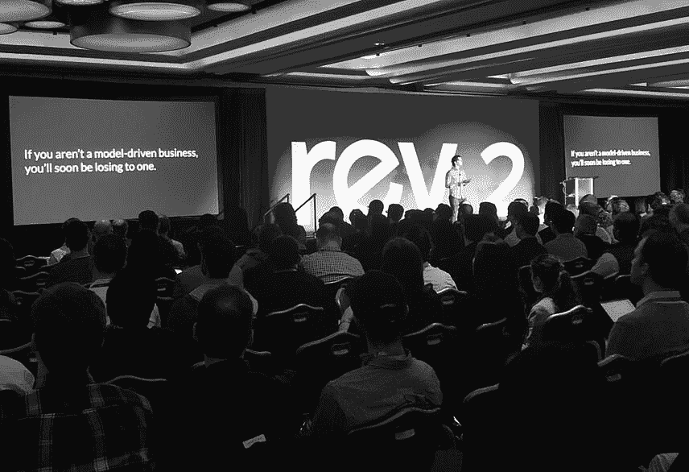
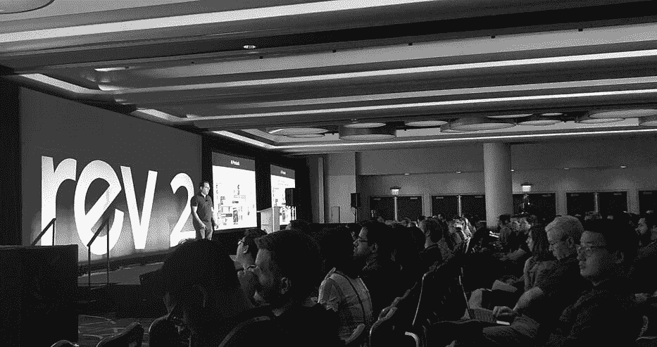
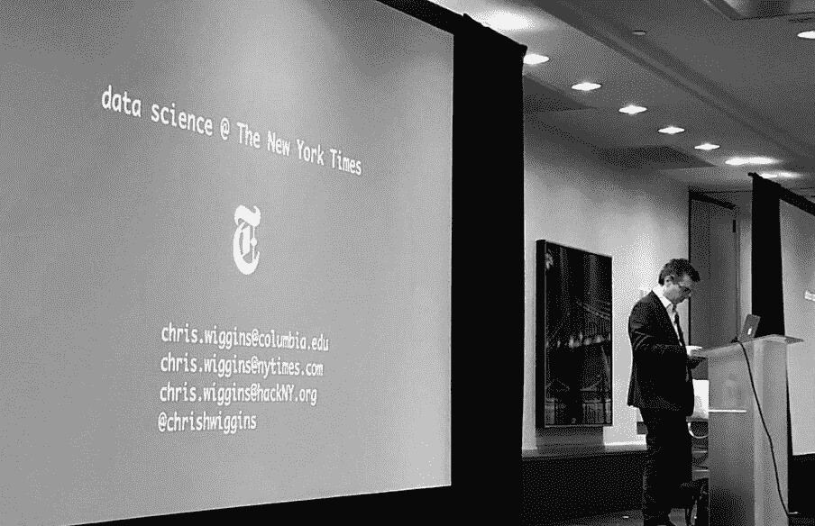
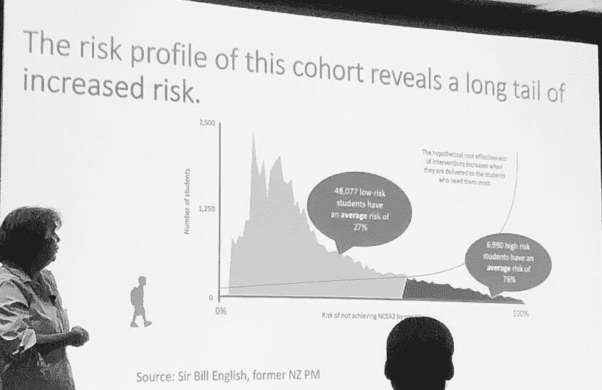

# 每个 Pacoid 的主题和会议，第 10 集

> 原文：<https://www.dominodatalab.com/blog/themes-and-conferences-per-pacoid-episode-10>

*<small>联席主席 Paco Nathan 提供了数据科学领袖峰会 Rev 2 的亮点。</small>*

## 介绍

欢迎回到我们每月一次的主题发现和会议总结。我们于 5 月 23 日至 24 日在纽约市举办了 Rev 2，作为“数据科学领导者及其团队相互学习的地方。”会议比去年增加了一倍多:2 天，3 个轨道，5 个赞助商，39 场会议，65 个演讲者，600 个与会者。许多评论、讨论、辩论等。，在社交媒体上大声说话，我会在这里提供一些指点。请注意，文章中没有足够的篇幅来充分涵盖这些演示，所以我将重点介绍主题演讲和几个我最喜欢的演讲。视频稍后会出来。

 Nick Elprin, CEO and co-founder of Domino Data Lab. Image Provided Courtesy of [A.Spencer of Domino.](https://blog.dominodatalab.com/author/ann-spencer/)

## 领导力

我们清单上的第一项:Rev 2 提到如何领导数据团队了吗？是啊！在很多很多方面。引用 Duo Security 的 Brian Lindauer 的话:

*   “非常享受[#多明诺夫](https://twitter.com/hashtag/dominorev?src=hash)的工作，以至于我想给数据科学的领导者们留一点时间。如果你领导一个数据科学团队/组织，请给我发邮件，我会邀请你参加[data-head.slack.com](https://data-head.slack.com/)

我们让数据科学领导者介绍了在领导数据科学团队时学到的经验教训，涵盖了可扩展性、模型驱动、模型知情以及如何有效塑造公司文化等关键方面。作为 Rev 的联合主席之一，我很遗憾没能看到每一场会谈。再次，我期待着视频！

## 数据科学领导力:规模、文化和专业化的重要性

我最喜欢的演讲之一，也是我不断听到与会者引用的一个演讲，是米歇尔·乌福德在第一天的主题演讲“网飞的数据科学:速度和规模的原则”。首先，她的幻灯片棒极了！其次，我在后台与 Michelle 进行了交谈，她通过从事机器学习项目进入了该领域，尽管最近她领导了支持数据科学团队的数据基础设施。她从大规模数据工程的角度，对数据科学团队的领导者有很多话要说*到*。我所说的“规模”是指任何非云提供商的上市公司在云中最大、最成功的数据分析操作。网飞是云原生的，建立在复杂的数据科学实践文化之上。就个性化而言，基于模型的决策的巨大规模令人吃惊；如果没有机器学习，像手动选择成千上万个节目的视频帧这样的工作就不可能实现。

Michelle 的演讲考察了简单性和灵活性之间的组织权衡，特别是通过实践如何随时间演进的视角；例如，组织如何应对挑战。我觉得网飞的工程实践非常有趣，因为 Ariel Tseitlin 领导了那里的云解决方案。例如，在 Rev 的前一天晚上享用晚餐时，一位密友质疑 Jupyter 在探索性数据科学之外的用途。我问，“你见过网飞的造纸厂吗？”第二天，Michelle 不假思索地提到了 Jupyter 笔记本电脑在生产中的应用，尤其是数据工程师的应用。换句话说，当你遇到一个问题时，让别人下次遇到同样的问题时更容易理解。让这成为公司文化的一部分。这就是工程的本质。朱庇特非常适合这个目的。

https://twitter.com/RandiRLudwig/status/1131563503121326080

Michelle Ufford 的另一项观察发现:对于数据团队如何处理问题，有太多的规定性规则会导致脆弱的过程和无效的文化。换句话说，团队级别的[自治](https://twitter.com/RandiRLudwig/status/1131570857522978816)允许更有效地扩展:

“我们雇佣有能力的人，然后离开他们。我们尽量减少政策，取消限制，给每个人自由和责任。”

我对此的反应是发自内心的。希望我能引用米歇尔过去 15 年的话！哇，这是我见过的公司(就我而言，过去的 5-6 家雇主)最大的绊脚石之一，公司领导人*禁止*如何处理数据，如何分析数据，以及如何组织数据科学团队。因为原因。因为不良文化。因为河马周围的焦虑和误解(收入最高的人的观点)，他们可能对技术和用例知之甚少。坏事就是这样发生的。在我见过的最令人震惊的[案例之一](https://secure.imvu.com/welcome/ftux/)中，一家硅谷科技初创公司的 [CEO](https://www.youtube.com/watch?v=HhwgyKDPHG4) 禁止员工为被解雇的前同事写 LinkedIn 推荐信。虽然花了几年时间，但最终他们的董事会在遭受巨大损失很久之后，还是让这位首席执行官离开了。

如果你没有注意到，企业高管通常不擅长禁止数据实践。事实上，[最近的行业调查](https://www.oreilly.com/ideas/three-surveys-of-ai-adoption-reveal-key-advice-from-more-mature-practices)指出了如何:

1.  公司文化是企业采用有效的数据相关实践的最大绊脚石之一。这些问题往往来自高层，即董事会层面的误解。
2.  许多拥有复杂数据实践的企业组织将这些决策交给数据科学团队领导，而不是高管或产品经理。

Michelle 的观察是我第一次在数据科学中看到与 Bruce Schneier 在他的书《超越恐惧:在不确定的世界中理智地思考安全问题 中关于安全的观点相对应的观点。套用 Schneier 的话来说，这就是集中化和统一性如何使安全工作变得脆弱:“深度防御，这意味着重叠责任以减少单点故障，无论是实际的防御事务还是情报职能。”同样，从认知的角度来看，集中化和统一性使数据科学方法变得脆弱，禁止领导是一个严重的失误。这与实现规模化不相容。

米歇尔和我在后台争论的一个主观观点是:*专业化*。

在网飞这种规模的组织中，团队需要与众不同。她的演讲提出了数据科学领域的人员进入专业角色的职业道路，如数据可视化工程师、算法工程师等。我通常反对过于专业化的职称——考虑到我们的领域是基于跨学科工作的。即便如此，我还是百分之百同意米歇尔的观点，我可以这样解释:引进擅长做多面手的人，然后让他们深入自己热爱的领域。这种方法非常适合企业的差异化需求。

## 数据科学领导:模型驱动和模型信息的重要性

考虑到 Rev 2 在很大程度上是关于领导力的，我很想把所有的评论放在同一个标题下。那不太公平，但是至少再多几个怎么样？ [Randi Ludwig](https://twitter.com/RandiRLudwig) ，戴尔技术公司的数据科学负责人，从 Domino 数据实验室的首席执行官和联合创始人 Nick Elprin 那里获得了这些关于模型驱动业务重要性的[禅 káans](https://twitter.com/RandiRLudwig/status/1131579022100586496):

*   “数据驱动就像通过观察后视镜来导航。模型驱动就像使用 GPS 一样。”
*   “如果您的企业正在使用大数据并将仪表盘放在分析师面前，您就没有抓住要点。”
*   “模型驱动是指足够自律，实际使用模型来做决策。仅仅做机器学习是不够的，有时甚至没有必要。”
*   还有…我最喜欢的 Rev 2 中的一句话…(等一下)…

 Nick Elprin. Image Provided Courtesy of [ A.Spencer of Domino](https://blog.dominodatalab.com/author/ann-spencer/)

这条箴言:“如果你不是一个模型驱动的企业，你很快就会输给一个。”

除了[模型驱动的业务](https://twitter.com/DominoDataLab/status/1031567846378233856)，另一个引起 Rev 2 与会者强烈共鸣的术语是[首席执行官兼 Coatue 联合创始人 Thomas Laffont](https://twitter.com/thomas_laffont) 所说的“模型信息”。FWIW，我的[主题演讲](https://derwen.ai/s/79q6)(【数据科学:过去和未来】“[见爆头表情符号](https://twitter.com/outoftheverse/status/1131934099629903872))是在 [Matthew Granade](https://twitter.com/MatthewGranade) 与 Thomas 和来自 Coatue 的 [Alex Izydorczyk](https://twitter.com/aleksizy) 的讨论之后。它们涵盖了我将要讨论的许多项目；我对他们小组的跟进似乎主要是将他们的关键点分解到时间线上，同时总结一些来自本专栏的更非传统的见解，然后预测可能的近期结果。像你一样。

https://twitter.com/RandiRLudwig/status/1131923454381502464

我对模型在“元合成-变量-吞噬世界”连续体中的位置的看法？

1.  我们领导人员加自动化(例如，模型)的团队来满足客户需求，在这些实体的任何一对之间都可能有许多惊人的双向反馈循环。也许不是模型驱动的，也不是无信息的，而是模型缠绕的。因为 I <3 图，网络，张量等等。话说回来，Gartner 和 Forrester 并不急于收购我的产品线。
2.  试图剖析一个模型来推测对其结果的解释是抛弃许多关键信息的好方法——特别是关于进入我们工作流程的非自动化输入和决策——这些信息是减轻存在风险所必需的。因为合规。诚然少了笛卡尔，多了[周三亚当斯](https://www.youtube.com/watch?v=2V8wDnSopaY)T2。

## 认知、决策和偏见

我们清单上的第二项:Rev 2 是否挖掘了一些关于认知和决策的奥秘？检查！

## 丹尼尔·卡内曼:扬声器出处

当被问及“谁会是关于数据科学领导力的著名演讲者？”我的回答几乎是立即的:丹尼尔·卡内曼。作为普林斯顿的心理学教授，畅销书《T2》《T3》《思考的快慢》《T4》《T5》的作者，[行为经济学的共同发明人](https://en.wikipedia.org/wiki/Behavioral_economics)(和阿莫斯·特沃斯基一起)，以及 [2002 年诺贝尔奖获得者](https://www.nobelprize.org/prizes/economic-sciences/2002/kahneman/facts/):

“将心理学研究的见解融入经济科学，尤其是关于人类在不确定情况下的判断和决策。”

我记得大约在 2012 年，一个“数据饮酒小组”在帕洛阿尔托的一家酒吧聚会，我无意中听到皮特·斯科莫洛赫和其他数据科学家谈论卡尼曼的工作。相反，他们喜气洋洋地谈论卡尼曼的工作及其在我们领域的重要性。显然，当我们处理数据和机器学习时，我们正在不确定性下的决策水域中游泳。无论一个组织是模型驱动的，还是模型通知的，或者任何与模型相关的相邻描述符，在某个点上，我们正在管理人员加上自动化的团队，并且人员——特别是他们的[领导](https://medium.com/leadership-motivation-and-impact/what-i-learned-from-thinking-fast-and-slow-a4a47cf8b5d5)——必须有效地处理概率过程。这就是诺贝尔委员会提到的人类判断发挥作用的地方。

 [Pete Skomoroch](https://twitter.com/peteskomoroch). Image Provided Courtesy of [A.Spencer of Domino.](https://blog.dominodatalab.com/author/ann-spencer/)

Pete [描述了](https://blog.dominodatalab.com/machine-learning-product-management-lessons-learned/)一般来说，机器学习如何将工程从确定性过程转变为概率性过程。不幸的是，人类不擅长概率。人类似乎是被进化硬连线成尖叫“呸！有怪物，大家快跑！”此外，考虑有人大喊“着火了！”在拥挤的剧院里。人类通常不会停下来评估怪物或火灾的可能性，在行动前会仔细思考。相反，他们往往会在匆忙逃离时相互踩踏。

## 克服认知偏差的影响

https://twitter.com/adelanyo/status/1131559485447856129

我们在 Rev 2 的第一天主题演讲中，卡尼曼博士介绍了“直觉判断和选择的心理学”你可以在 [Twitter 帖子](https://twitter.com/pacoid/timelines/1134862788545744896)上看到许多精彩内容。由于 Claude Shannon，噪声及其与 T2 信息论的密切关系在 20 世纪中期成为使用概率工具的研究主题。在他的主题演讲中，卡尼曼提出了一个探索噪音与人类认知和决策的主题。

*   [tweet-quote](https://twitter.com/DominoDataLab/status/1131563226880258048) :“人类有很多有价值的输入；他们有印象，他们有判断。但是人类不太擅长以可靠和健壮的方式整合信息。这就是算法的设计目的——它们减少噪音。”
*   [tweet-quote](https://twitter.com/RandiRLudwig/status/1131553870033891330) :“人类是嘈杂的，我们更喜欢自然的而不是人工的，尽管模型通常比人更好。”
*   [tweet-quote](https://twitter.com/pacoid/status/1131557909429653504) :“人们在做出决定后需要一个对结果感觉良好的故事——只是不要太快。先讨论证据再讨论直觉。”

除了介绍，即更多的描述和轶事方面，卡尼曼探索了我们可以用来克服认知偏见影响的工具。对我来说，最深刻的是一种测量组织内部噪音的简单方法。要做到这一点，首先要审查员工做出的量化决策，例如，保险理赔员报出的结算价格。衡量这些决定在你的人群中是如何变化的。然后计算[方差除以均值](https://twitter.com/pacoid/status/1131557909429653504)来构建决策中噪声的度量。公共服务建议:一定要把那个流氓包在[置信区间](https://www.mathsisfun.com/data/confidence-interval.html)里。

Kahneman 描述了在许多专业组织中，人们如何直观地估计该指标接近 0.1——然而，在现实中，该值通常超过 0.5，因此员工的总体决策过程比随机决策过程表现更差。比扔硬币还糟糕！对于 kicks，尝试在您自己的组织内计算这种指标。显然，在这些情况下，成为模型驱动解决了一个存在的风险，这就是 Nick Elprin 在他的主题演讲中提出的观点。更好的训练(对人和对模型)也被指出。

另一个微妙但有力的建议是:在会议辩论开始前收集证据，以避免确认偏差。换句话说，在任何人开始表明立场之前，让人们私下表达他们的担忧。否则，人们会倾向于支持早期表达的观点。卡尼曼[描述了](https://twitter.com/RandiRLudwig/status/1131555361595506688)T4【决策分析】的历史:

*“决策分析要接管业务，但后来首席执行官们不想要了。他们不想犯错或事后批评。当 ML 模型开始预测首席执行官的决策以及他们是否感到威胁时，这将是令人着迷的。”*

真心话很少说。这里有一点很重要，数据科学实际上只解决了一部分难题。决策分析有一个完全不同的领域，涉及我们如何处理数据科学提供的行动。最近有一些人对这一点颇有微词——卡西·科兹尔科夫和 T2·阿贾伊·阿格拉瓦尔最先出现在我的脑海中。卡尼曼认为，一旦 ML 模型开始扰乱/自动化高管决策的价值，这一切都会让*变得真正*有趣。

## 用预死亡解决认知偏差

这可能需要一段时间。就近期而言，卡尼曼建议使用[前预测](https://en.wikipedia.org/wiki/Pre-mortem)——也称为逆向预测，作为预测的逆命题。这种做法在引入会议中固有的认知偏见之前，正式确定了收集证据的方式。这是一种利用人类认知偏见产生切实结果的方式。

参加 Rev 的其中一个人是 Carl Spetzler，他是 T2 拉姆齐奖章获得者，也是 SRI 名人堂的决策分析专家。在会议后期，我与卡尔进行了交谈，我强烈推荐他最近的“ [Rethink: Premortem 3.0](https://sdg.com/webinars/premortem-3-0-best-prevention-postmortem/) ”网络研讨会。虽然网上研讨会的讨论开始有点奇怪，但人们很快意识到他们(1)正在与现场观众一起运行预分析的组件，以及(2)利用主持人来减少偏见。他们正在使用一个名为 [PowerNoodle](https://www.powernoodle.com/) 的基于云的工具来自动化一些死前过程的机制。

说真的，在我的下一次创业中，没有先利用事前分析就安排会议很可能会成为一种可解雇的罪行。这种实践对于支持多样性和包容性，对于避免由于人类概率困难而可能被忽略的灾难，对于消除在会议中一次又一次听同一只河马嗡嗡叫而浪费的时间，都是必不可少的。

公平地说，卡尼曼说了一两句让我皱起眉头的话。其他与会者也有同感。有人评论 ML 模型中嵌入了[偏见，与歧视有关，我不太相信他说的话。此外，Kahneman 似乎在多个点上谈论 ML 模型的全自动使用，而没有考虑模型评估、审计、人在回路、模型透明度或当前其他相关问题。在他的主题演讲后有一个活跃的问答环节，如果我们有更多的时间，我很想深入探讨这些问题。](https://twitter.com/outoftheverse/status/1131559763907698690)

## 实际上，困难的问题

[克里斯·维金斯](http://www.columbia.edu/~chw2/)是哥伦比亚大学教授，《纽约时报》首席数据科学家， [hackNY](https://hackny.org/) 的联合创始人。如果你研究一下我们领域的起源，你会很快发现 Chris 一直在撰写和教授有关数据科学的历史，例如，哥伦比亚大学的“[数据:过去、现在和未来](http://www.columbia.edu/~chw2/)”课程——你可能已经注意到，这是我最喜欢的主题之一。尽管我们从未见过面，但我们已经参与论坛好几年了。可以说，我从与克里斯的几次交谈中学到的东西比会议其他人学到的加起来还多。

 [Chris Wiggins.](http://www.columbia.edu/~chw2/) Image Provided Courtesy of [A.Spencer of Domino](https://blog.dominodatalab.com/author/ann-spencer/)

在他的第二天会议演讲“纽约时报的数据科学”中，Chris 以“演讲”开始，几乎我的每个编辑都让我坐下来重新讲述新闻业中的“政教分离”。他将这两个关注点的图表显示为单独的框，然后添加了另一个标有“数据”的框，作为两者的共同基础。通过区分*描述性分析*、*预测性分析*和*规定性分析*，Chris 讲述了几个关于经理如何从数据科学中要求一种可交付成果，而需要完全不同的东西的故事。在我们的领域中，领导力的一个关键方面是认识到这些区别，并重新构建项目以适应业务需求，而不仅仅是响应请求。例如，一个*描述性*仪表板的请求“比较红色按钮或蓝色按钮是否导致较低的流失率”可能更好地由一个*说明性*模型提供，以个性化页面，使客户流失率更低。不要犹豫，要积极主动。另一个主题是关于内部决策的项目结果作为面向客户的产品出现的频率——只要销售人员看到哪些见解可以浮出水面，然后货币化。这是对数据科学和我们团队流程跨学科本质的重要提醒。

https://twitter.com/pacoid/status/1131975765594169346

NYU 大学创新分析研究员、[柯勒律治倡议](https://coleridgeinitiative.org/)的联合创始人 Julia Lane 在第一天发表了题为“数据在哪里:社会科学搜索和发现的新方法”的会议演讲。这项工作是根据最近成为联邦法律的[循证决策法案](https://www.congress.gov/bill/115th-congress/house-bill/4174)进行的。它也代表了 Jupyter 项目当前关注的一部分:增加对协作、增强的安全性、作为顶级实体的项目、数据注册、元数据管理和使用遥测的支持。主要的工作称为[富上下文](https://github.com/jupytercalpoly/rich-context-demo)，为近期利用 Jupyter 和其他基于 [FedRAMP 合规性](https://www.fedramp.gov)的敏感数据开源项目铺平了道路。从长远来看，它将利用机器学习和知识图合成/推理来支持高度监管环境中的协作数据科学工作。

 [Julia Lane](https://wagner.nyu.edu/community/faculty/julia-lane#). Image Provided Courtesy of [A.Spencer of Domino](https://blog.dominodatalab.com/author/ann-spencer/)

假设来说，如果特定的联邦计划有被削减的风险，除非他们能证明他们的结果，但所需的数据是在人口普查，国税局，平视显示器，伊利诺伊州校正等。，不可能在保持合规性的同时运行跨机构的连接…那么很明显，许多重要的社会服务面临被削减的风险。朱庇特和 NYU 一直忙于解决这个问题。除了政府用例之外，这项工作对于一般企业中的数据科学具有巨大的效用。完全披露:我是这一努力的一部分，并代表 NYU 提供咨询。

在另一个我最喜欢的演讲中，来自美国陆军特种作战司令部的 Robert Toguchi 在第一天发表了“培养变革文化”的演讲。与企业规模和数据科学的合规性要求相比，军方面临着企业组织特有的巨大挑战，以及与机器学习进步保持同步的额外方面。后者还有一个微妙之处，即快速发展的[对抗性机器学习](https://github.com/kenny-co/procedural-advml)领域正变得越来越具有对抗性。在不深入细节的情况下，人们甚至可以发现代表大国最新人工智能技术的人工智能团队在 Kaggle 上相互竞争——这不再是“代理战争”的问题，而是在真实和模拟之间交换数据集的问题。换句话说，这些可能会升级为更激烈的冲突。国防部可以从企业学习数据科学的经验中获益良多，也可以从开源中获益良多。鉴于过去十年左右大数据的“提交者战争”,我发现这一点特别有趣:现在我们在流行的开源项目中看到更多的非供应商贡献者。我认为这是一个健康的趋势。

此外， [Josh Wills](https://twitter.com/josh_wills) 发表了第一天的闭幕主题演讲“如何与他人合作”，这可以说是关于数据科学和领导力的最务实的演讲之一，尤其是关于“无限循环的~~悲伤~~同理心”的部分。这与“[用数据计算:概念和挑战](https://www.tandfonline.com/doi/abs/10.1080/00031305.1999.10474434)”中的另一个著名例子非常吻合，约翰·钱伯斯(R 语言的发明者)引用了约翰·图基(数据分析的发明者)。只要有机会，就跑，不要走，去听乔希讲话。

## Rev 2 总结

我们跟随 Josh 参加了一个名为[感官数据科学](https://medium.com/derwen/data-science-in-the-senses-5fb72c758f11)的社交聚会，展示了几个利用感官数据的项目。这甚至包括一种定制鸡尾酒，仅在 Rev 2 中提供。对于另一个“仅在第二版”的功能，我们放弃了[袜子](https://twitter.com/pacoid/timelines/1134953656057339904)作为施瓦格！当我们到达纽约时，我几乎忘记了几个月前的一项任务，我们在那里描述了数据科学历史上的名人，然后制作了袜子来纪念他们:格蕾丝·赫柏、托马斯·贝叶斯、凯伦·斯帕克·琼斯、约翰·图基、阿达·洛芙莱斯。为了确保 NLP 的代表性，我当然买了[凯伦·斯帕克·琼斯](https://twitter.com/pacoid/status/1131626015040655361)的袜子。

https://twitter.com/LeapingLlamas/status/1131973679192203266

Rev 2 提供了一个难得的、非常需要的关于数据科学领导力的论坛，团队可以在这里相互学习实践。多米诺数据实验室赞助了这种独特的形式，特别是联合主席乔恩·鲁尼(Jon Rooney)和 T2(Karina Babcock)，他们熟练地处理了会议发言人的介绍，并为会议做了大量的核心工作。我想说这是一个独一无二的事件，除了我们每年都这样做。2020 年 Rev 3 见！

## 即将举行的活动

要在日历上标记的与数据相关的[事件](https://derwen.ai/events#watchlist):

*   [佩塔卢马沙龙](https://www.meetup.com/Petaluma-Salon/events/260912356/)，6 月 5 日——我将主持一场关于约翰·巴尔的人工智能主题书评，
    “脸书和中国正在争相成为对方吗？”
*   伦敦，6 月 10 日至 12 日
*   [麻省理工学院 EmTech Next](https://events.technologyreview.com/emtech/next/19/) ，6 月 11-12 日，波士顿
*   [Jupyter 社区研讨会](https://blog.jupyter.org/jupyter-community-workshop-south-america-d8e482652952)，6 月 22-23 日，科尔多瓦
*   [git 提交展](https://blog.invidelabs.com/git-commit-show/)，6 月 22-23 日，在线
*   7 月 5 日至 6 日，柏林
*   [OSCON](https://conferences.oreilly.com/oscon/oscon-or/public/cfp/746) ，7 月 15 日至 18 日，CFP:我将于 7 月 16 日主持“ML 运营:管理端到端 ML 生命周期”专题讲座