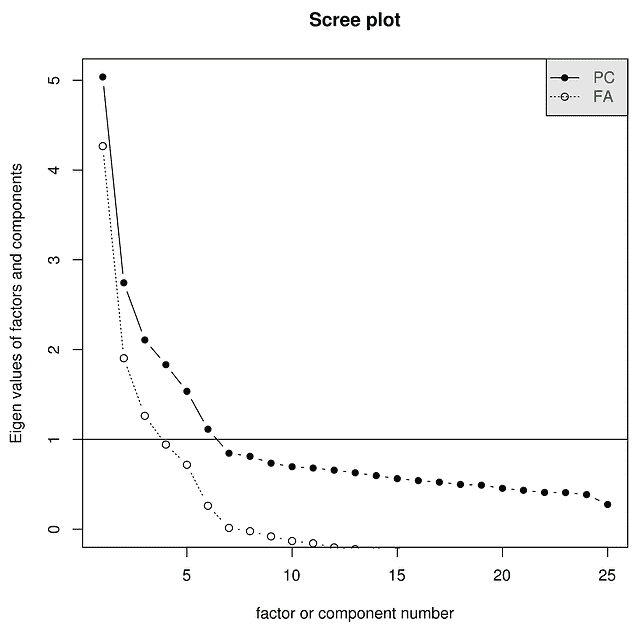
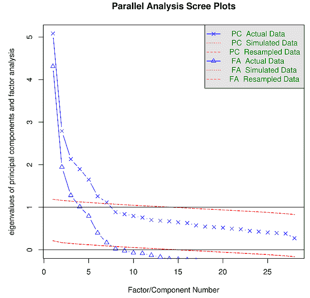

# 如何在 R 中做因子分析

> 原文：<https://www.dominodatalab.com/blog/how-to-do-factor-analysis>

## 什么是因子分析？

p 值。t 型测试。分类变量。所有这些都是最被滥用的统计技术或数据科学工具的竞争者。然而，因素分析是一个完全不同的球赛。尽管远未被过度使用，但它无疑是最有争议的统计技术，因为它在关于一般智力的辩论中发挥了作用。你不认为统计技术会造成分裂，是吗？[不算加州大学伯克利分校统计部门离开安德鲁·盖尔曼的那一次。]

在数据科学教科书中，因子分析是一种总是与 PCA 一起被提及的技术，但后来被忽略了。这就像量子力学的多重世界解释，不，这是数据科学的星球大战假日特辑。大家都模模糊糊的熟悉，但似乎没人真正了解。

因素分析旨在洞察人们行为和选择背后的潜在变量。另一方面，主成分分析是通过选择捕捉最大差异的维度来最紧凑地表示数据集。这种区别可能很微妙，但一个显著的区别是，PCA 假设数据中没有测量误差或噪声:所有的“噪声”都包含在方差捕获中。另一个重要的区别是，研究人员的自由度(T1)的数量，或者说一个人必须做出的选择，比 PCA 要多得多。不仅要选择要提取的因子的数量(大约有 10 个很少收敛的理论标准)，还要决定提取的方法(大约有 7 个)，旋转的类型(也有 7 个)，以及是否使用方差或协方差矩阵，等等。

因素分析的目标是弄清楚用户的许多个人行为是否不能用较少数量的潜在特征来解释。更具体地说，想象你经营一家餐馆。虽然你的一些顾客吃得很健康，但你注意到许多人经常点一份布丁配他们的营养甘蓝沙拉。作为一个好奇和以数据为导向的餐馆老板，你提出了一个假设——每一份订单都可以用一个“健康”维度来解释，同时点 Poutine 和 kale 沙拉的人处于一个维度的中间，这个维度的一端是“只吃 Kale 和壁球”，另一端是“只吃培根”。

然而，你注意到这可能无法解释客户实际下单方式的差异，所以你提出了另一个维度——也许有两个维度，一个是关于人们有多爱或讨厌羽衣甘蓝，另一个是关于人们有多爱或讨厌 Poutine。你认为，也许这些维度是正交的。也许它们有些负相关。也许还有一个维度与你的顾客有多喜欢菜单上的其他竞争菜品有关。

你开始注意到你自己的假设中的趋势，并意识到可能存在任何数量的理论化维度。您真正想知道的是解释客户下单方式最大差异的最小维度数量。大概是吧，这样你就可以把更多的郁闷留给自己了。(因为那东西很好吃)。

从更专业的角度来说，进行因子分析在数学上相当于问一个精通统计学的甲骨文:“假设有 N 个潜在变量影响着人们的选择——告诉我每个变量对我看到的每个项目的影响有多大，假设所有东西都存在测量误差”。通常，被分析的“行为”或回答是以人们如何回答调查中的问题的形式出现的。

从数学上来说，对于人 *i* ，项目 *j* 和行为 Y<sub>ij，因子分析寻求确定以下内容:</sub>

> y<sub>*ij*</sub>= W<sub>*J1*</sub>* F<sub>*i1*</sub>+W<sub>*J2*</sub>* F<sub>*I2*</sub>+…+U<sub>*ij*</sub>

其中，W 是因子权重或载荷，F 是因子，U 是测量误差/方差，不能用等式中的其他项来解释。创建因子分析的人的见解是，这个方程实际上是一个矩阵简化问题。

就像任何技术一样，它不会盲目运行——您必须确定要提取的因子数量，类似于使用 PCA 选择要减少的维度数量。关于你应该选择哪个数字，有许多指标；我过会儿会检查最好的。我提到这一点是因为当你阅读关于因子分析的指南和论文时，最大的关注点是恰当地提取正确数量的因子。毫无疑问，这是需要担心的事情。然而，最重要的部分因素或所有数据分析，唉，几乎从来没有提到。在进行数据或因素分析时，要注意的第一件事是，你的大脑有向你撒谎的倾向。考虑到因子分析中涉及的研究人员自由度惊人的数量，很容易证明做出不同选择的合理性，因为结果不符合你的直觉。

不相信我？试试这个:杰克、乔治和安妮是一个晚宴的客人。杰克看着安妮，安妮看着乔治。杰克结婚了，乔治没有。已婚的人在看未婚的人吗？

a)是
B)否
C)信息不足。

大多数人在阅读这个问题时，意识到其中有一个技巧，并抓起一张纸来找出答案。然后他们选择 c。这似乎是合乎逻辑的。然而，正确答案是 A——安妮结婚与否并不重要。雷诺真的在洛杉矶的西边。斗争仍在继续。

除非你有意识地反对它，否则你的大脑会试图将其先入为主的观念合理化到你的分析中。这通常采取向上或向下舍入因子负载的形式，或者证明要提取多少因子。记住:[你要相信数据所说的你应该相信的](http://wiki.lesswrong.com/wiki/Litany_of_Tarski)。

## R 中的因子分析入门

### 预处理

在你做因素分析之前，你需要一些东西。

第一:如果你还没有 R 和 RStudio，下载它们。然后获得' [Psych](https://cran.r-project.org/web/packages/psych/index.html) '包。它是无与伦比的免费因素分析软件。通过键入`library(psych)`来加载它

接下来:获取数据。在我这边，我将使用心理软件包附带的数据集。这些数据是以人格问题回答的形式存在的，被称为“五大清单”。然而，任何类型的行为记录都可以——在一天结束时，你需要能够制作一个完整的关联矩阵。样本量越大越好。400-500 的样本量通常被认为是一个好的经验法则。

现在好戏开始了。心理软件包是一个方便的功能。(注意:每一对字母数字代表一种性格‘特质’，用 6 分制的李克特量表表示。)

```py
> describe(bfi)

          vars    n  mean    sd median trimmed   mad min max range  skew kurtosis   se
A1           1 2784  2.41  1.41      2    2.23  1.48   1   6     5  0.83    -0.31 0.03  
A2           2 2773  4.80  1.17      5    4.98  1.48   1   6     5 -1.12     1.05 0.02  
A3           3 2774  4.60  1.30      5    4.79  1.48   1   6     5 -1.00     0.44 0.02  
A4           4 2781  4.70  1.48      5    4.93  1.48   1   6     5 -1.03     0.04 0.03  
A5           5 2784  4.56  1.26      5    4.71  1.48   1   6     5 -0.85     0.16 0.02  
C1           6 2779  4.50  1.24      5    4.64  1.48   1   6     5 -0.85     0.30 0.02  
C2           7 2776  4.37  1.32      5    4.50  1.48   1   6     5 -0.74    -0.14 0.03  
C3           8 2780  4.30  1.29      5    4.42  1.48   1   6     5 -0.69    -0.13 0.02  
C4           9 2774  2.55  1.38      2    2.41  1.48   1   6     5  0.60    -0.62 0.03  
C5          10 2784  3.30  1.63      3    3.25  1.48   1   6     5  0.07    -1.22 0.03  
E1          11 2777  2.97  1.63      3    2.86  1.48   1   6     5  0.37    -1.09 0.03  
E2          12 2784  3.14  1.61      3    3.06  1.48   1   6     5  0.22    -1.15 0.03  
E3          13 2775  4.00  1.35      4    4.07  1.48   1   6     5 -0.47    -0.47 0.03  
E4          14 2791  4.42  1.46      5    4.59  1.48   1   6     5 -0.82    -0.30 0.03  
E5          15 2779  4.42  1.33      5    4.56  1.48   1   6     5 -0.78    -0.09 0.03  
N1          16 2778  2.93  1.57      3    2.82  1.48   1   6     5  0.37    -1.01 0.03  
N2          17 2779  3.51  1.53      4    3.51  1.48   1   6     5 -0.08    -1.05 0.03  
N3          18 2789  3.22  1.60      3    3.16  1.48   1   6     5  0.15    -1.18 0.03  
N4          19 2764  3.19  1.57      3    3.12  1.48   1   6     5  0.20    -1.09 0.03  
N5          20 2771  2.97  1.62      3    2.85  1.48   1   6     5  0.37    -1.06 0.03  
O1          21 2778  4.82  1.13      5    4.96  1.48   1   6     5 -0.90     0.43 0.02  
O2          22 2800  2.71  1.57      2    2.56  1.48   1   6     5  0.59    -0.81 0.03  
O3          23 2772  4.44  1.22      5    4.56  1.48   1   6     5 -0.77     0.30 0.02  
O4          24 2786  4.89  1.22      5    5.10  1.48   1   6     5 -1.22     1.08 0.02  
O5          25 2780  2.49  1.33      2    2.34  1.48   1   6     5  0.74    -0.24 0.03  
gender      26 2800  1.67  0.47      2    1.71  0.00   1   2     1 -0.73    -1.47 0.01  
education   27 2577  3.19  1.11      3    3.22  1.48   1   5     4 -0.05    -0.32 0.02  
age         28 2800 28.78 11.13     26   27.43 10.38   3  86    83  1.02     0.56 0.21
```

这个数据集中包含了一些人口统计数据，我将对这些数据进行修剪，以便进行因子分析。

```py
df <- bfi[1:25]
```

虽然因子分析适用于协方差和相关矩阵，但推荐的做法是使用相关矩阵。没错——你真正需要的只是一个不同行为指标的关联矩阵(即使那个行为是‘点击一个按钮’、‘以某种方式回答一个问题’，或者‘实际上给了我们钱’)。

## 确定因子的数量

尽管有无数的指标来确定要提取的“适当”数量的因子，但除了检查各种因子解决方案并解释结果的悠久传统之外，还有两种主要的技术。第一个是检查一个 scree 图，或一个“特征值与因子/成分数”的图表。(另一方面，整平地块通常涉及大量水泥)

```py
>scree(df)
```



在某一点之后，每一个额外的因素或分量将导致特征值的微小减少。(翻译:每个额外的因素并不能解释太多的差异。)通常会有一些“肘”，这个想法是你选择最后一个仍然减少方差的因素。这是主观的吗？是的。直觉可以围绕这个规则建立吗？是的。

提醒一句:有一种倾向是只取特征值大于 1 的因子的个数。这是一个近乎普遍的错误。不要这样做。已经警告过你了。此外，这有助于确保您以全尺寸查看 scree 图，而不仅仅是在小 RStudio 图窗口中查看。

在这种情况下，如果我们严格遵循“找到手肘”规则，看起来“6”是一个人可以逃脱的最高数字。还有更复杂的方法来仔细检查要提取的因子的数量，比如平行分析。对平行分析的描述，承蒙 [*《植物科学杂志》*](http://opensiuc.lib.siu.edu/cgi/viewcontent.cgi?article=1004&context=pb_pubs) :“在此过程中，来自旋转前数据集的特征值与来自相同维度(p 个变量和 n 个样本)的随机值矩阵的特征值进行比较。”这个想法是，任何低于随机产生的特征值都是多余的。

```py
>fa.parallel(bfi)
```

平行分析表明因子数= 6，组分数= 6

以下是绘图输出:



通过知道你在想“好的，我们已经决定了要提取的因子的数量。我们能快点结束吗？我的朋友正在做 PCA，她已经离开去吃她的甘蓝和 Poutine 午餐。”没那么快。我们必须弄清楚如何提取 6 个因素，然后我们是否以及如何旋转它们来帮助我们的解释。

## 因子提取

有太多的因素提取技术，其中大部分的优点在这篇激动人心的论文中进行了比较。

以下是你需要知道的。有三种主要的因子提取技术:普通最小二乘法(也称为“最小残差”，简称“Minres”)、最大似然法和主轴因子分解法。已经发现 OLS /明里斯在各种情况下优于其他方法，并且通常给出的解决方案接近于使用最大似然法时得到的结果。最大似然法很有用，因为你可以计算置信区间。主轴因子分解是一种广泛使用的方法，它将大部分方差放在第一个因子上。与所有数据分析一样，如果您的数据中有来自新方法或实验的可靠的、有意义的结果或信号，那么您所关心的应该是不受因子提取技术影响的。但是，如果你的工作对因素加载分数和解释的微小差异很敏感，那么就值得花时间找出哪种工具最适合你。对于 bfi 数据的探索性分析，ols / minres 方法就足够了

## 旋转

因素提取是一回事，但它们通常很难解释，这可以说挫败了这项工作的全部意义。为了对此进行调整，通常是“旋转”，或者在 n 因子子空间中选择稍微不同的轴，以便您的结果更易于解释。本质上，轮换牺牲了一些可以解释的差异，以实际了解正在发生的事情。(这有点手动波动，但是大多数，如果不是所有著名的 20 世纪心理测量学家都强烈推荐旋转。)

与羽衣甘蓝完全不同，轮换有两种不同的味道。正交旋转假设因子不相关，而倾斜旋转假设它们相关。正交和斜交的选择取决于您的特定用例。如果您的数据包含来自一个大域的项目，并且您没有理由认为某些行为可能完全不相关，请使用倾斜旋转。如果你想了解更多，请点击[这里](http://www.utdallas.edu/~herve/Abdi-rotations-pretty.pdf)查看简要概述，点击[这里](http://jalt.org/test/PDF/Brown31.pdf)查看更深入的内容。

两种常见的旋转类型是 Varimax(正交)和 Oblimin(倾斜)。鉴于我正在分析的数据是基于个性项目的，我将选择 oblimin 旋转，因为有很好的先验理由假设个性因素不是正交的。

因子分析在 R 中有一个非常简单的命令:

```py
> fa(df,6,fm='minres',rotate='oblimin')
```

```py
Factor Analysis using method =  minres  
Call: fa(r = df, nfactors = 6, rotate = "oblimin", fm = "minres")  
Standardized loadings (pattern matrix) based upon correlation matrix  
     MR2   MR1   MR3   MR5   MR4   MR6   h2   u2 com
A1  0.10 -0.11  0.08 -0.56  0.05  0.28 0.33 0.67 1.7  
A2  0.04 -0.03  0.07  0.69  0.00 -0.06 0.50 0.50 1.0  
A3 -0.01 -0.12  0.03  0.62  0.06  0.10 0.51 0.49 1.2  
A4 -0.07 -0.06  0.20  0.39 -0.11  0.15 0.28 0.72 2.2  
A5 -0.16 -0.21  0.01  0.45  0.12  0.21 0.48 0.52 2.3  
C1  0.01  0.05  0.55 -0.06  0.18  0.07 0.35 0.65 1.3  
C2  0.06  0.13  0.68  0.01  0.11  0.17 0.50 0.50 1.3  
C3  0.01  0.06  0.55  0.09 -0.05  0.04 0.31 0.69 1.1  
C4  0.05  0.08 -0.63 -0.07  0.06  0.30 0.55 0.45 1.5  
C5  0.14  0.19 -0.54 -0.01  0.11  0.07 0.43 0.57 1.5  
E1 -0.13  0.59  0.11 -0.12 -0.09  0.08 0.38 0.62 1.3  
E2  0.05  0.69 -0.01 -0.07 -0.06  0.03 0.55 0.45 1.1  
E3  0.00 -0.35  0.01  0.15  0.39  0.21 0.48 0.52 2.9  
E4 -0.05 -0.55  0.03  0.19  0.03  0.29 0.56 0.44 1.8  
E5  0.17 -0.41  0.26  0.07  0.22 -0.02 0.40 0.60 2.9  
N1  0.85 -0.09  0.00 -0.06 -0.05  0.00 0.70 0.30 1.0  
N2  0.85 -0.04  0.01 -0.02 -0.01 -0.08 0.69 0.31 1.0  
N3  0.64  0.15 -0.04  0.07  0.06  0.11 0.52 0.48 1.2  
N4  0.39  0.44 -0.13  0.07  0.11  0.09 0.48 0.52 2.5  
N5  0.40  0.25  0.00  0.16 -0.09  0.20 0.35 0.65 2.8  
O1 -0.05 -0.05  0.08 -0.04  0.56  0.03 0.34 0.66 1.1  
O2  0.11 -0.01 -0.07  0.08 -0.37  0.35 0.29 0.71 2.4  
O3 -0.02 -0.10  0.02  0.03  0.66  0.00 0.48 0.52 1.1  
O4  0.08  0.35 -0.02  0.15  0.38 -0.02 0.25 0.75 2.4  
O5  0.03 -0.06 -0.02 -0.05 -0.45  0.40 0.37 0.63 2.1

                       MR2  MR1  MR3  MR5  MR4  MR6
SS loadings           2.42 2.22 2.04 1.88 1.67 0.83  
Proportion Var        0.10 0.09 0.08 0.08 0.07 0.03  
Cumulative Var        0.10 0.19 0.27 0.34 0.41 0.44  
Proportion Explained  0.22 0.20 0.18 0.17 0.15 0.07  
Cumulative Proportion 0.22 0.42 0.60 0.77 0.93 1.00

 With factor correlations of 
      MR2   MR1   MR3   MR5   MR4   MR6
MR2  1.00  0.25 -0.18 -0.10  0.02  0.18  
MR1  0.25  1.00 -0.22 -0.31 -0.19 -0.06  
MR3 -0.18 -0.22  1.00  0.20  0.19 -0.03  
MR5 -0.10 -0.31  0.20  1.00  0.25  0.15  
MR4  0.02 -0.19  0.19  0.25  1.00  0.02  
MR6  0.18 -0.06 -0.03  0.15  0.02  1.00

Mean item complexity =  1.7  
Test of the hypothesis that 6 factors are sufficient.

The degrees of freedom for the null model are  300  and the objective function was  7.23 with Chi Square of  20163.79  
The degrees of freedom for the model are 165  and the objective function was  0.36 

The root mean square of the residuals (RMSR) is  0.02  
The df corrected root mean square of the residuals is  0.03 

The harmonic number of observations is  2762 with the empirical chi square  660.84  with prob <  1.6e-60  
The total number of observations was  2800  with MLE Chi Square =  1013.9  with prob <  4.4e-122 

Tucker Lewis Index of factoring reliability =  0.922  
RMSEA index =  0.043  and the 90 % confidence intervals are  0.04 0.045  
BIC =  -295.76  
Fit based upon off diagonal values = 0.99  
Measures of factor score adequacy  
                                                MR2  MR1  MR3  MR5  MR4  MR6
Correlation of scores with factors             0.93 0.89 0.88 0.87 0.85 0.77  
Multiple R square of scores with factors       0.87 0.80 0.78 0.77 0.73 0.59  
Minimum correlation of possible factor scores  0.73 0.59 0.56 0.53 0.46 0.18  
```

这个输出中有很多内容，我不会全部展开——您可以在 psych 包的文档中找到更多细节。打印输出中包括模型与数据拟合程度的指标。标准的经验法则是 RMSEA 指数应该小于 0.06。为了方便起见，我把它突出显示了出来。其他指标可能是有价值的，但每个都有一个或三个不适用的具体案例，rmsea 适用于所有情况。仔细检查以确保这个值不是太高。然后，有趣的部分——通过打电话来粗略检查这些因素

```py
> print(fa(df,6,fm='minres',rotate='oblimin')$loadings,cut=.2)
```

```py
Loadings:  
       MR2     MR1     MR3     MR5     MR4     MR6   
A1                    -0.558                  0.278  
A2                    0.690  
A3                    0.619  
A4                    0.392  
A5            -0.207          0.451           0.208  
C1                    0.548  
C2                    0.681  
C3                    0.551  
C4                    0.632                   0.300  
C5                    0.540  
E1            0.586  
E2            0.686  
E3            0.349                   0.391   0.207  
E4            -0.551                          0.288  
E5            -0.405  0.264           0.224  
N1    0.850  
N2    0.850  
N3    0.640  
N4    0.390   0.436  
N5    0.403   0.255                           0.202  
O1                                    0.563  
O2                                    -0.367  0.352  
O3                                    0.656  
O4            0.354                   0.375  
O5                                    -0.451  0.400

                 MR2   MR1   MR3   MR5   MR4   MR6
SS loadings    2.305 1.973 1.925 1.700 1.566 0.777  
Proportion Var 0.092 0.079 0.077 0.068 0.063 0.031  
Cumulative Var 0.092 0.171 0.248 0.316 0.379 0.410  
```

请务必查看最后一个因素—在这种情况下，最后一个因素上的负载都不是最高的，这表明它是不必要的。因此，我们转向 5 因素解决方案:

```py
> fa(df,5,fm='minres','oblimin')
```

```py
Factor Analysis using method =  minres  
Call: fa(r = df, nfactors = 5, n.obs = "oblimin", fm = "minres")  
Standardized loadings (pattern matrix) based upon correlation matrix  
     MR2   MR3   MR5   MR1   MR4   h2   u2 com
A1  0.20  0.04 -0.36 -0.14 -0.04 0.15 0.85 2.0  
A2 -0.02  0.09  0.60  0.01  0.03 0.40 0.60 1.1  
A3 -0.03  0.03  0.67 -0.07  0.04 0.51 0.49 1.0  
A4 -0.06  0.20  0.46 -0.04 -0.15 0.29 0.71 1.7  
A5 -0.14  0.00  0.58 -0.17  0.06 0.48 0.52 1.3  
C1  0.06  0.53  0.00  0.05  0.16 0.32 0.68 1.2  
C2  0.13  0.64  0.11  0.13  0.06 0.43 0.57 1.2  
C3  0.04  0.56  0.11  0.08 -0.06 0.32 0.68 1.1  
C4  0.12 -0.64  0.06  0.04 -0.03 0.47 0.53 1.1  
C5  0.14 -0.57  0.01  0.16  0.10 0.43 0.57 1.4  
E1 -0.09  0.10 -0.10  0.56 -0.11 0.37 0.63 1.3  
E2  0.06 -0.03 -0.09  0.67 -0.07 0.55 0.45 1.1  
E3  0.06 -0.02  0.30 -0.34  0.31 0.44 0.56 3.0  
E4  0.00  0.01  0.36 -0.53 -0.05 0.52 0.48 1.8  
E5  0.18  0.27  0.08 -0.39  0.22 0.40 0.60 3.1  
N1  0.85  0.01 -0.09 -0.09 -0.05 0.71 0.29 1.1  
N2  0.82  0.02 -0.08 -0.04  0.01 0.66 0.34 1.0  
N3  0.67 -0.06  0.10  0.14  0.03 0.53 0.47 1.2  
N4  0.41 -0.16  0.09  0.42  0.08 0.48 0.52 2.4  
N5  0.44 -0.02  0.22  0.25 -0.14 0.34 0.66 2.4  
O1 -0.01  0.06  0.02 -0.06  0.53 0.32 0.68 1.1  
O2  0.16 -0.10  0.21 -0.03 -0.44 0.24 0.76 1.9  
O3  0.01  0.00  0.09 -0.10  0.63 0.47 0.53 1.1  
O4  0.08 -0.04  0.14  0.36  0.38 0.26 0.74 2.4  
O5  0.11 -0.05  0.10 -0.07 -0.52 0.27 0.73 1.2

                                 MR2  MR3  MR5  MR1  MR4
SS loadings                     2.49 2.05 2.10 2.07 1.64  
Proportion Var                  0.10 0.08 0.08 0.08 0.07  
Cumulative Var                  0.10 0.18 0.27 0.35 0.41  
Proportion Explained            0.24 0.20 0.20 0.20 0.16  
Cumulative Proportion           0.24 0.44 0.64 0.84 1.00

 With factor correlations of 
      MR2   MR3   MR5   MR1   MR4
MR2  1.00 -0.21 -0.03  0.23 -0.01  
MR3 -0.21  1.00  0.20 -0.22  0.20  
MR5 -0.03  0.20  1.00 -0.31  0.23  
MR1  0.23 -0.22 -0.31  1.00 -0.17  
MR4 -0.01  0.20  0.23 -0.17  1.00

Mean item complexity =  1.6  
Test of the hypothesis that 5 factors are sufficient.

The degrees of freedom for the null model are  300  and the objective function was  7.23 with Chi Square of  20163.79  
The degrees of freedom for the model are 185  and the objective function was  0.63 

The root mean square of the residuals (RMSR) is  0.03  
The df corrected root mean square of the residuals is  0.04 

The harmonic number of observations is  2762 with the empirical chi square  1474.6  with prob <  1.3e-199  
The total number of observations was  2800  with MLE Chi Square =  1749.88  with prob <  1.4e-252 

Tucker Lewis Index of factoring reliability =  0.872  
RMSEA index =  0.055  and the 90 % confidence intervals are  0.053 0.057  
BIC =  281.47  
Fit based upon off diagonal values = 0.98  
Measures of factor score adequacy  
                                                MR2  MR3  MR5  MR1  MR4
Correlation of scores with factors             0.93 0.88 0.88 0.88 0.85  
Multiple R square of scores with factors       0.86 0.77 0.78 0.78 0.72  
Minimum correlation of possible factor scores  0.73 0.54 0.56 0.56 0.44  
```

these me丰富 而【h】上的美国

```py
> print(fa(df,5,fm='minres',rotate='oblimin')$loadings,cut=.2)
```

```py
Loadings:  
          MR2     MR3     MR5     MR1     MR4 
A1        0.204           -0.360  
A2                        0.603  
A3                        0.668  
A4                        0.456  
A5                        0.577  
C1                0.532  
C2                0.637  
C3                0.564  
C4                -0.643  
C5                -0.571  
E1                                0.565  
E2                                0.667  
E3                        0.303   -0.342  0.315  
E4                        0.362   -0.527  
E5                        0.274   -0.394  0.223  
N1    0.852  
N2    0.817  
N3    0.665  
N4    0.413               0.420  
N5    0.439               0.223   0.247  
O1                                        0.534  
O2                        0.211           -0.441  
O3                                        0.633  
O4                                0.357   0.378  
O5                                        -0.522

                 MR2   MR3   MR5   MR1   MR4
SS loadings    2.412 1.928 1.922 1.839 1.563  
Proportion Var 0.096 0.077 0.077 0.074 0.063  
Cumulative Var 0.096 0.174 0.250 0.324 0.387  
```

马上，这个装载表看起来干净多了——物品显然装载在一个主要因素上，并且物品似乎被神奇地按字母分组。剧透:正是这种分析最初导致心理测量学家和个性研究人员得出结论，人际差异有五个主要维度:宜人性、责任心、外向性、神经质(有时称为情绪稳定性)和开放性。这些术语中的每一个都有精确的技术定义，通常与你在对话中使用这些词的方式不同。但那是一个完全不同的故事。

现在是因素分析最有意义的部分——为因素或结构找出一个简洁的名字，它可以解释人们是如何以及为什么做出选择的。顺便说一句，如果您没有指定最适合该数据的因素的数量，这就很难做到。

*有趣的是，似乎只有心理测量学家认为因素分析是“有益的”。

这实际上只是冰山一角——在特殊类型的旋转和因子提取、双因子解决方案中涉及到更多的复杂性...别让我从因素得分开始。因素分析是一种强大的技术，也是解释用户行为或观点的好方法。从这种方法中最重要的收获是，因子分析揭示了研究在利用统计工具时必须做出的选择数量，选择数量与大脑将其自身投射到数据上的机会数量成正比。其他看起来更简单的技术只是在幕后做出了这些选择。然而，没有一个有因子分析的传奇历史。