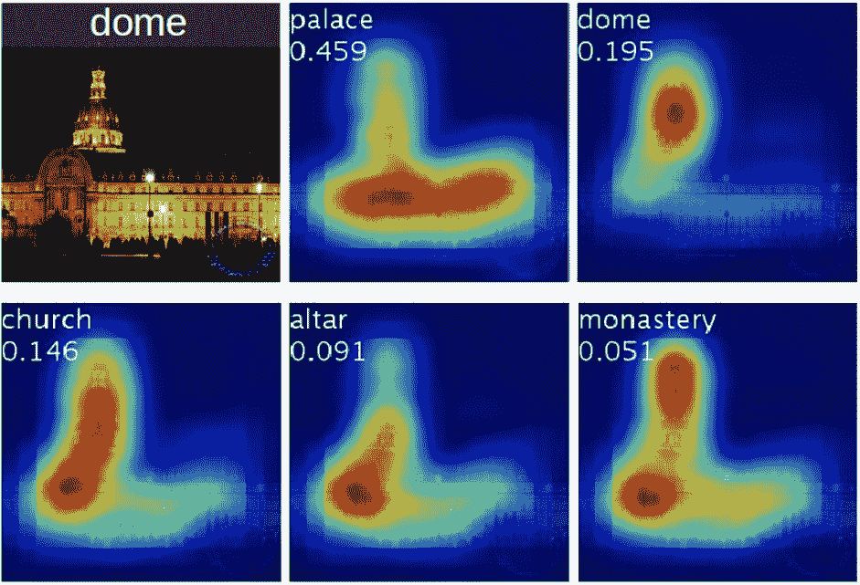
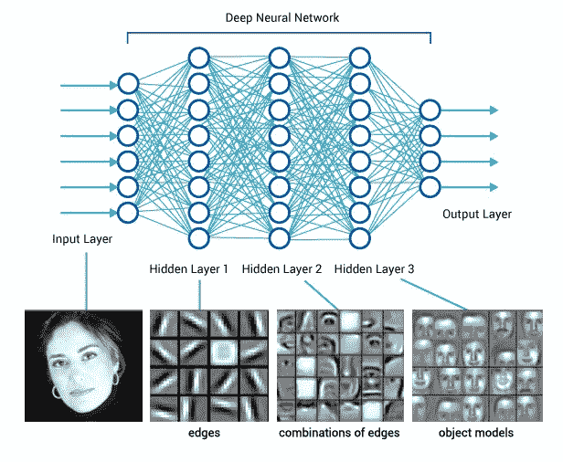
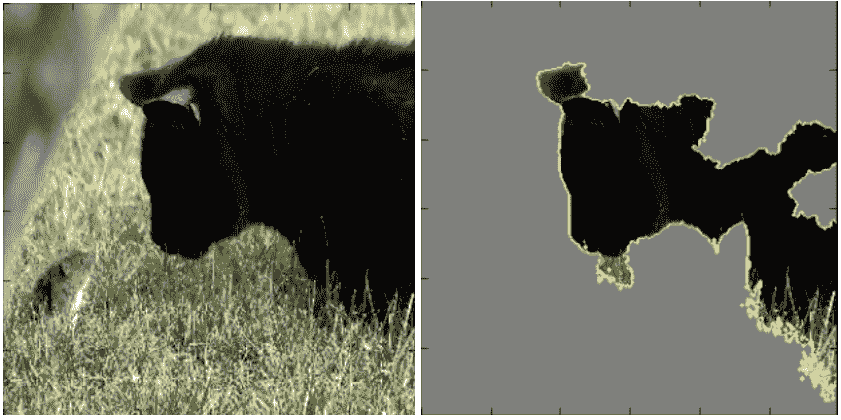
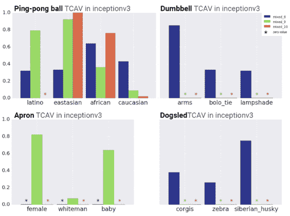
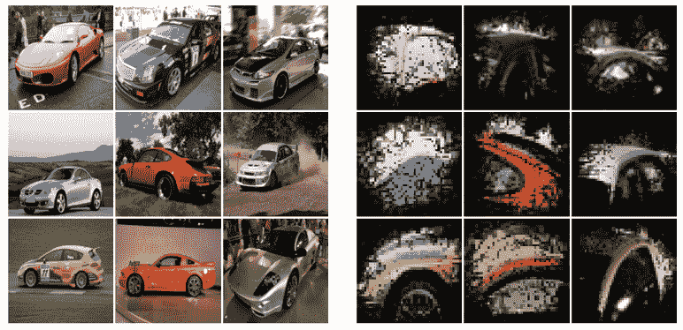
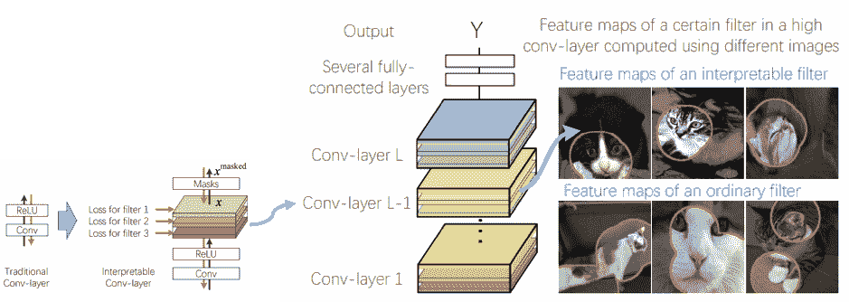
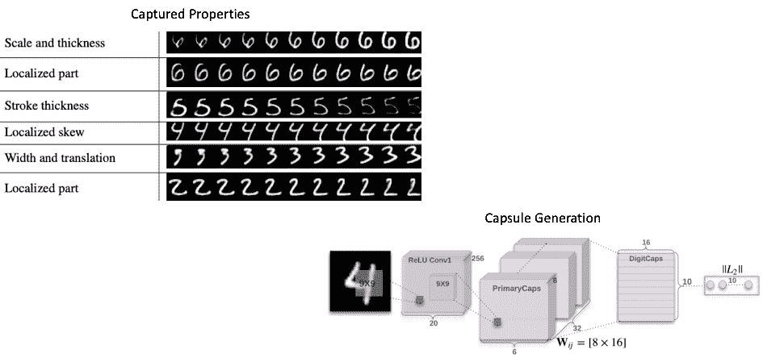

# 走向概念构建——深度神经网络模型可解释性综述

> 原文：<https://www.dominodatalab.com/blog/trending-toward-concept-building-a-review-of-model-interpretability-for-deep-neural-networks>

当谈到验证模型时，我们正处于行业中一个有趣的时期——当你考虑它时，这是一个十字路口。从业者和领导者有机会通过支持适当的模型验证来做出真正的改变。这项工作必须包括可解释性和可解释性技术。解释深度神经网络是如何工作的很难。这是学术界和工业界的一个活跃的研究领域。数据科学家需要保持与时俱进，以创建安全可用的模型。领导者需要知道如何避免不道德、有偏见或被误解的模型的风险。在这篇文章中，我分析了应用于图像数据的网络可解释性的趋势。所涉及的一些方法也适用于非基于图像的网络。

## 来自像素影响...

[深度神经网络](/deep-learning-introduction)的大部分模型解释工作都是基于分析输入对分类的影响。对于图像数据，这意味着查看每个像素的重要性。典型的结果是一个显著图，就像这里显示的那样。

There are many ways to build a saliency map. Here we see the top 5 predicted categories for an image using a technique called Class Activation Mapping explained in this paper: [https://arxiv.org/pdf/1512.04150.pdf](https://arxiv.org/pdf/1512.04150.pdf) 

在他们介绍 TCAV 的论文(稍后讨论)中，作者指出了基于像素的方法的局限性。

1.  仅提供局部可解释性
2.  无法控制这些地图选择的概念
3.  随机化网络产生的显著性图类似于训练网络产生的显著性图(Adebayo 等人，2018 年)
4.  简单的无意义的数据处理步骤，可能导致显著性方法产生重大变化(Kindermans et al .，2017)。
5.  显著图也可能容易受到对抗性攻击(Ghorbani 等人，2017 年)。

## …接下来是概念提取和构建

新的研究提出了一个更好的方法——关注概念。概念是存储在网络高层中的图像的构建块。它们可以是基本的，如角、边、曲线、纹理、色调、位置、大小等。它们也可以是一些组件的集合，比如猫的脸或汽车的车顶。

Networks do a good job of learning concepts that increase in complexity with each layer. Source: [Medium](https://medium.com/diaryofawannapreneur/deep-learning-for-computer-vision-for-the-average-person-861661d8aa61)

最初的可解释性工作集中在*提取*网络在试图对图像进行分类的自然过程中发现的概念。然而，最近出现了非常令人兴奋的研究，围绕*从基本原则构建*概念，目标是优化更高层，使其可读。该网络不是为了纯粹的准确性而优化，而是以一种专注于高级概念的强定义的方式来构建。换句话说，我们优化的是可解释性，而不是预测准确性。种种迹象表明，这样做最终可能会提高预测的准确性。

在接下来的部分中，我将介绍与刚才讨论的技术相关的各种方法。一定要坚持到概念构建的最后一部分。看到管道里的东西是令人兴奋的。

## 基于像素影响的方法综述

### 显著图

介绍可以在[https://arxiv.org/pdf/1312.6034.pdf](https://arxiv.org/pdf/1312.6034.pdf)找到

### 深 SHAP

“DeepLIFT 最近被提出作为深度学习的递归预测解释方法[8，7]。它赋予每个输入一个值，代表该输入被设置为参考值而不是其原始值的效果……(我们)调整了 DeepLIFT，使其成为 SHAP 值的组合近似值，从而导致深度 SHAP。”[https://proceedings . neur IPS . cc/paper/2017/file/8 a20 a 8621978632d 76 c 43 DFD 28 b 67767-paper . pdf](https://proceedings.neurips.cc/paper/2017/file/8a20a8621978632d76c43dfd28b67767-Paper.pdf)

### 石灰

“当对图像分类器使用稀疏线性解释时，人们可能希望只突出显示对特定类别具有正权重的超像素，因为它们给出了关于为什么模型会认为该类别可能存在的直觉。”([https://arxiv.org/pdf/1602.04938.pdf](https://arxiv.org/pdf/1602.04938.pdf)

This image was incorrectly classified as a black bear. The collection of positive weight pixels on the right shows what the network focused on for this image. Image source: [https://arxiv.org/pdf/1602.04938.pdf](https://arxiv.org/pdf/1602.04938.pdf) 

## 锚

“锚定解释”是一种规则，它充分“锚定”了本地预测，因此对实例的其余特征值的更改无关紧要。换句话说，在锚固定的情况下，预测(几乎)总是一样的。”([https://www . aaai . org/OCS/index . PHP/AAAI/aaai 18/paper/view/16982/15850](https://www.aaai.org/ocs/index.php/AAAI/AAAI18/paper/view/16982/15850))

What part of the beagle image does the network think is most influential in deciding to apply the label of beagle? In other words, if we superimpose that part of the image on any other image it will still predict a beagle. Image source: [https://www.aaai.org/ocs/index.php/AAAI/AAAI18/paper/view/16982/15850](https://www.aaai.org/ocs/index.php/AAAI/AAAI18/paper/view/16982/15850) 

## 基于概念抽取的方法综述

### TCAV

允许研究人员在他们的网络中测试高级的、人类可理解的概念的重要性。使用概念激活向量(TCAV)进行测试，可以很容易地找到可能引起伦理问题或被怀疑混淆分类的概念。作者给出的一个例子是在识别图像中一个人的种族时检查乒乓球的存在。创建了三个模型。在 TCAV 之后，研究人员有数据来丢弃那些与乒乓球的存在相混淆的模型，从而避免了一个泛化能力差且不道德的模型。

Image source: [https://arxiv.org/abs/1711.11279](https://arxiv.org/abs/1711.11279)

### (American Cinema Editors)美国电影电视剪接师协会

基于概念的自动解释(ACE)是一种混合方法，它依赖于像素影响，但也测试概念的存在。它旨在消除手工设计概念的需要和概念选择中的人为偏见，如在 TCAV 所使用的。它采用一个经过训练的分类器和一组图像作为输入。然后，它提取该类中的概念(通常以像素组的形式)并返回每个概念的重要性。

Image source: [Cornell](https://arxiv.org/abs/1902.03129) 

### 影响导向的解释

这种方法将单个实例的传统输入影响与高级概念的激活神经元识别(概念提取)相结合。它识别具有高影响力的神经元，并提供可视化技术来解释它们所代表的概念。当你把许多图像拼接在一起时，你就获得了全局可解释性，这对于大多数网络来说是很难实现的。

Taking a model trained to classify convertibles, we see that the influence-directed explanation almost always looks at the roof of the car, giving us confidence that the model has learned the right concept. Image source: [Carnegie Mellon University](https://arxiv.org/pdf/1802.03788.pdf)

## 基于概念构建的方法综述

### 可解释 CNN

在没有任何额外的人工监督的情况下，网络被优化以使用过滤器来自动推动网络中的高 conv 层表示来表示可理解的对象部分。每个过滤器必须编码一个独特的对象部分，这是唯一的一个类别。这些对象部分通常是人类可以解释的。迫使网络的各层代表人类可以理解的对象的部分，使得解释整个网络变得相对容易。预期损失会发生，但通常是最小的。

“Interpretable convolutional neural networks (CNN) add a regularization loss to higher convolutional layers of CNN to learn disentangled representations, resulting in filters that could detect semantically meaningful natural objects.” [Image and quote source](http://openaccess.thecvf.com/content_cvpr_2018/papers/Zhang_Interpretable_Convolutional_Neural_CVPR_2018_paper.pdf)

### CapsNet

胶囊表示图像中特定实体的属性，例如位置、大小、方向、速度、反照率、色调、纹理等。该模型学习对部分和整体之间的关系进行编码，这导致概括成新视点的视点不变知识。CapsNet 方法最初是纯监督的，但现在使用无监督的结构提取和简单的分类器进行标记。“现在对胶囊的研究与本世纪初对用于语音识别的递归神经网络的研究处于相似的阶段。有基本的代表性理由相信这是一种更好的方法，但它可能需要更多的细微见解，才能超越高度发达的技术。一个简单的胶囊系统已经在分割重叠数字方面提供了无与伦比的性能，这一事实表明胶囊是一个值得探索的方向。”([https://papers . nips . cc/paper/6975-dynamic-routing-between-capsules . pdf](https://papers.nips.cc/paper/6975-dynamic-routing-between-capsules.pdf))

Image source:  [NeurIPS Proceedings](https://papers.nips.cc/paper/6975-dynamic-routing-between-capsules.pdf)

## 从这里去哪里

这是数据科学研究中一个激动人心的重要领域。为了更广泛、更深入地探究这个话题，我建议查看一下我最近关于可解释性的会议演讲的[录音。](https://www.dominodatalab.com/resources/data-science-playbook-for-explainable-ai/)

最后，我要指出的是，这一切都很好，但如果数据科学家和分析领导者在他们的验证工作流程中不关注模型的可解释性，这将是无效的。然后，一旦我们，作为一个行业，把我们的模型验证方面处理好了，我们将需要把许多相同的技术转移到模型维护方面。模型和输入数据会随时间漂移，可能会引入训练中没有的偏差。是的，有很多工作要做，但这也意味着我们每个人都有足够的机会在我们的组织中加强和支持正确的模型验证。

Joey Kyber 在 Unsplash 上的横幅照片