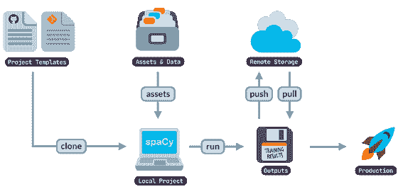
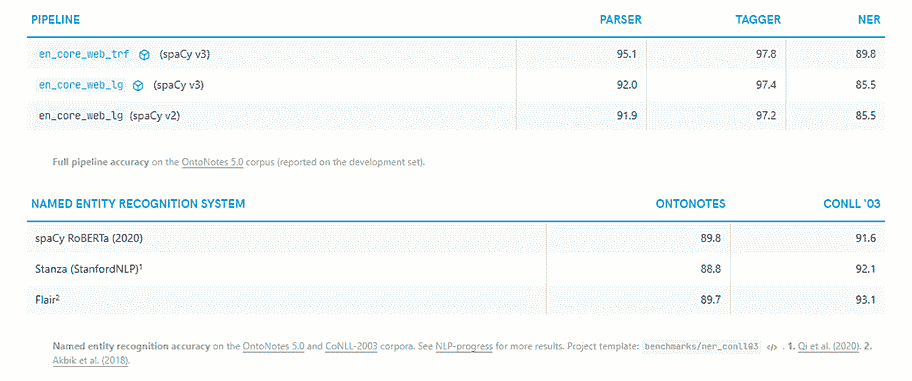

# 采用 spaCy v3 的企业级 NLP

> 原文：<https://www.dominodatalab.com/blog/enterprise-class-nlp-with-spacy-v3>

spaCy 是一个 python 库，它提供了进行高级自然语言处理分析和构建模型的能力，这些模型可以支持文档分析、聊天机器人功能和所有其他形式的文本分析。

spaCy 库在麻省理工学院的许可下可用，主要由来自爆炸[E](https://explosion.ai/)爆炸的 Matthew Honnibal、Ines Montani、Sofie Van Landeghem 和 Adriane Boyd 开发。AI 。

最新版本 spaCy 3.0 带来了许多改进，有助于构建、配置和维护您的 NLP 模型，包括

*   新培训和再培训的**基于变压器的管道**显著提高了精确度。
*   额外的**配置功能**构建您的训练工作流程并调整您的训练跑步
*   **快速启动小工具**帮助构建您的配置文件
*   更容易与其他工具集成，如 **Streamlit** 、 **FastAPI、**或 **Ray** ，以构建向最终用户提供结果的工作流。
*   **利用 Ray 的并行/分布式**功能加快训练周期
*   包装器使你能够带来其他框架，如 **PyTorch** 和 **TensorFlow**

这些特性结合在一起，使得 spaCy 在处理大量文本和调整您的配置以匹配您的特定用例方面比以往任何时候都更好，从而提供更好的准确性。



Retrieved from https://spacy.io/

## 入门指南

之前，我们发表了一篇博客，介绍了安装步骤和 spaCy 的介绍，spaCy 将原始文本处理成 NLP 文档，并以多种不同的方式完成了分析和可视化数据所需的步骤，包括实体检测和情感分析。

附在那个博客上，我们还包括了一个关于[https://try.dominodatalab.com](https://try.dominodatalab.com/)的参考项目，可以在[这里](https://try.dominodatalab.com/u/domino-johnjoo/spacy-dev/overview)找到，它为你提供了一个预配置的环境和项目，给你一个尝试 spaCy 的简单方法。

### 改进的基于变压器的管道

将原始文本处理成 NLP 工作流的第一步是将文本标记成文档对象。这通常被称为处理流水线。spaCy 包括许多不同的预建处理管道，涵盖不同的语言和偏好设置，根据您的使用情况和处理文本的速度，提供更高的准确性或更高的效率。

这些经过训练的管道包括执行不同功能的组件，例如

*   **实体识别** -在文档中查找人、地点、项目或时间戳。
*   词性——识别文档中的名词、动词、形容词和副词。
*   **依存解析器** -识别单词的关系和本体，以评估它们的上下文。

这些组件是在将原始文本转换为 NLP 文档对象的初始阶段作为参数添加的。


spaCy processing pipeline diagram retrieved from [https://spacy.io](https://spacy.io)

这里，我们将三段单独的文本解析成一个文档，然后对文本中所有找到的实体进行汇总。

```
import spacy

texts = [
"David works as a Data Scientist at Domino Data Lab",
"Domino Data Lab is a company that provides enterprise-class data science capabilities through its platform.",
"David joined Domino Data Lab in February 2020."]

nlp = spacy.load("en_core_web_lg")

for doc in nlp.pipe(texts, disable=["tagger", "parser"]):

    # Print all found entities within the document.

    print([(ent.text, ent.label_) for ent in doc.ents])
```

这段代码的输出正确地识别出文档中输入了一个人、一个组织和一个日期。

```
[('David', 'PERSON')]

[('Domino Data Lab', 'ORG')]

[('David', 'PERSON'), ('Domino Data Lab', 'ORG'), ('February 2020', 'DATE')]
```

这是可能的，因为我们将预训练的处理管道称为初始加载的一部分——“en _ core _ web _ LG”。这些预先配置的模型是处理文本的良好开端；然而，spaCy 3.0 中包含了一个小部件来帮助您优化配置。



Bench-marking data from [https://spacy.io](https://spacy.io)

这些模型经常权衡效率和质量分数。例如，如果我们将预先训练的模型从“en_core_web_lg”更改为“en_core_web_sm ”,我们会看到文档的处理时间要快得多。尽管如此，我们也注意到它没有正确地将 Domino Data Lab 标记为一个组织，而是认为它是一个人。

```
import spacy

texts = [
"David works as a Data Scientist at Domino Data Lab",
"Domino Data Lab is a company that provides enterprise-class data science capabilities through its platform.",
"David joined Domino Data Lab in February 2020."

]

nlp = spacy.load("en_core_web_sm")

for doc in nlp.pipe(texts, disable=["tagger", "parser"]):

    # Print all found entities within the document.

    print([(ent.text, ent.label_) for ent in doc.ents])
```

```
[('Domino Data', 'PERSON')]

[('David', 'PERSON'), ('Domino Data', 'PERSON'), ('February 2020', 'DATE')]
```

这些预先配置的模型是处理文本的良好开端；然而，spaCy 3.0 中包含了一个小部件来帮助您优化配置。

### 配置文件和快速启动小部件

spaCy v3 引入了一个扩展的配置系统，允许您创建一个包含要应用的设置、超参数和 NLP 组件的配置文件。

配置文件可以很容易地调用到您的项目中。

```
python -m spacy init fill-config base_config.cfg config.cfg
```

一个配置文件的优点是没有隐藏的元素来处理你的模型。这可以让您在回顾结果时看到模型运行的确切设置，以及将配置保存为文件的常见版本控制方面。


How config files are used within spaCy

配置文件还允许您包含您已经内置在其他框架中的定制模型和函数，提供了灵活性以确保您如何运行您的空间模型是为手边的用例专门构建的。

spaCy v3 还包括一个方便的 Quickstart 小部件，它允许您生成一个起点配置文件，该文件是根据许多推荐的设置构建的，这些设置可以在您调整模型时进行调整。


spaCy Quickstart widget retrieved from [https://spacy.io](https://spacy.io)

### 空间项目

项目是 spaCy v3 中的一个全新特性，它允许您创建和使用参考项目架构，为所有 NLP 工作流设置模式和实践。

项目还包括几个预定义的项目模板，旨在与[数据科学工具](/blog/data-science-tools)集成，让您跟踪和管理您的数据，通过可视化共享您的结果，并将您的模型作为 API。


Project templates available within spaCy

这种在数据科学团队内部构建典型 NLP 工作流的能力有助于提高效率，并以系统化的方式处理组织内部的所有 NLP 任务。

## 结论

spaCy v3 代表了该库整体上的一个重大改进。新训练的处理管道显著提高了 spaCy 生成的所有输出的准确性。包含配置文件、项目模板和集成使您能够更轻松地配置和控制 NLP 项目在您的团队中的运行方式，从而提高您为最终用户提供结果的速度。

现有组件的改进和处理管道中新组件的包含，例如依存关系匹配、句子识别和形态预测，为用户提供了更多分析文本和产生准确和相关结果的能力。添加包装器来允许您从其他模型库中调用函数也扩展了这种灵活性，以定制您如何构建、训练和部署您的模型。

要亲自试用 spaCy，请在[https://try.dominodatalab.com](https://try.dominodatalab.com)注册试用，并从我们的 spaCy 参考项目开始，该项目可在[https://try . dominodatalab . com/u/domino-John joo/spaCy-dev/overview](https://try.dominodatalab.com/u/domino-johnjoo/spacy-dev/overview)找到