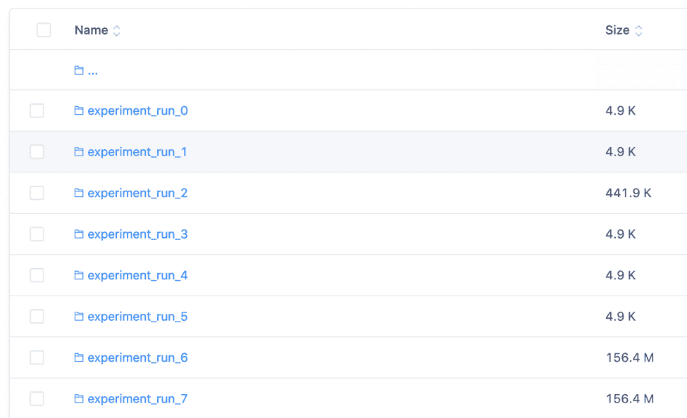
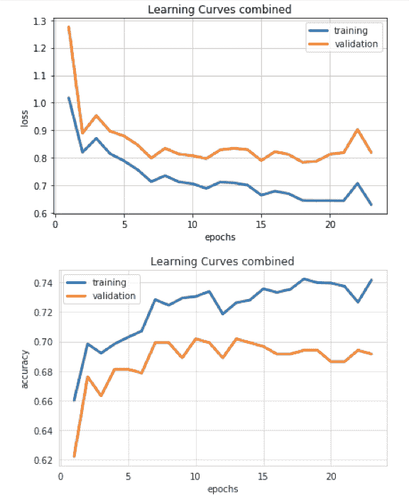

# 路德维希深度学习实践指南

> 原文：<https://www.dominodatalab.com/blog/a-practitioners-guide-to-deep-learning-with-ludwig>

Joshua Poduska 提供了 Ludwig 的概要，包括何时使用 Ludwig 的命令行语法以及何时使用其 Python API。

## 介绍

新工具不断被添加到[深度学习生态系统](https://www.dominodatalab.com/blog/deep-learning-illustrated-building-natural-language-processing-models)。寻找正在被创建的工具类型的趋势可能是有趣的和有益的。例如，最近创建了多个有前途的工具，它们具有 Python APIs，构建在 [TensorFlow](https://hackernoon.com/tensorflow-is-dead-long-live-tensorflow-49d3e975cf04?gi=122a76332524) 或 [PyTorch](https://pytorch.org/) 之上，并封装了深度学习最佳实践，以允许数据科学家加快研究速度。例子包括[路德维希](https://github.com/uber/ludwig)和 [Fast.ai](https://www.fast.ai/) 。

这篇博文考虑了 Ludwig，提供了该包的简要概述，并为从业者提供了一些提示，比如何时使用 Ludwig 的命令行语法，以及何时使用其 Python API。这个博客还提供了 Jupyter 笔记本的代码示例，您可以通过 Domino 提供的主机下载或运行。

## 路德维希设计原则

我最近参加了在旧金山优步总部举行的一次聚会。路德维希的主要建筑师和维护者皮耶罗·莫里诺提出。他把路德维希的魔力总结为三点:

1.  数据类型抽象
2.  通过 YAML 文件的模型定义
3.  巧妙使用关键词论证(* *夸尔斯)

我将简要地解释一下为什么 Peiro 会做出这样的声明，在你阅读我的解释之前，你可能会发现从[优步工程博客](https://eng.uber.com/introducing-ludwig/)中查看 Ludwig 设计工作流程的[图](https://1fykyq3mdn5r21tpna3wkdyi-wpengine.netdna-ssl.com/wp-content/uploads/2019/02/image3.png)会有所帮助。

从数据类型抽象开始他们的分析策略，使优步工程团队能够更好地集成深度学习最佳实践，用于模型训练、验证、测试和部署。Ludwig 可以对不同类型的数据集使用相同的数据预处理和后处理。这个抽象概念扩展到编码器的应用。编码器就是简单的深度网——平行 CNN，堆叠 CNN，堆叠平行 CNN，RNN 等等。为一个任务开发的相同的编码和解码模型可以被重新用于不同的任务。

虽然专家可以处理这些网络的细节，但新手也可以访问模型训练的成熟默认设置。通过 YAML 文件很容易插入新的编码器、解码器和组合器。专家或中间用户也发现使用用户指南中的许多可选* *参数来调整模型行为和超参数很简单。

Ludwig 允许用户训练模型、加载模型、使用该模型进行预测并运行实验。这些操作通过命令行或编程 API 运行。在 Ludwig 中训练模型只需要 CSV 数据集和模型定义 YAML 文件。

## 路德维希实验和输出

实验功能抓住了路德维希包的本质，因为它统一了所有的设计原则。在一个实验中，Ludwig 将创建一个带有 hdf5 扩展的中间预处理版本的输入 CSV。第一次在相同的目录中使用具有相同名称的 CSV 文件时会发生这种情况，随后的实验运行会利用该数据。Ludwig 随机拆分数据，并在训练集上训练模型，直到验证集的准确性停止提高。实验记录和输出可以在结果目录中找到，其中包含超参数和过程的汇总统计信息。我发现这种自动记录非常有用。在我的工作中，每次运行代表模型的一次调整是很常见的。Ludwig 输出自动组织在目录中。你可以给每个实验命名，或者像我一样使用默认的名字。



在与 Ludwig 合作时，如果您有目的地管理这种自动生成的输出，会有所帮助。将输出目录与 Git 项目同步，添加提交注释，或者使用 Domino 提供的自动再现引擎，可以在您尝试重新创建结果时省去很多麻烦。关键是要以一种你能记住变化的方式来组织你的实验。

## 路德维希从业者提示

在你找到在工作中利用它的最佳方式之前，使用任何新工具都会产生一些成长的烦恼。在这一节中，我总结了我在使用 Ludwig 时学到的经验，以帮助您更快地进行自己的评估。

### 从业者提示# 1——命令行对于运行实验来说非常有用。

Ludwig 的大多数功能都可以通过命令行或 Python API 获得。然而，正如本[讨论主题](https://github.com/uber/ludwig/issues/267)中所指出的，一些编程 API 函数在技术上是可访问的，但尚未得到完全支持。命令行功能更加全面。这方面的一个例子是路德维希实验。虽然在使用 API 时需要一步一步地运行，但当通过命令行调用时，Ludwig 会自动拆分数据，并在训练集上训练模型，直到验证集的准确性停止提高——这是一个很好的功能。

下面是通过命令行开始实验的语法示例。

```
ludwig experiment \
--data_csv sequence_tags.csv \
--model_definition_file model_definition.yaml
```

另一方面，您需要通过 Python API 自己进行训练和测试。


### 从业者提示# 2——可视化的命令行调用在某些系统上可能很难使用。

让可视化显示可能是一个令人沮丧的练习。基本的代码改进正在进行中，包括保存图像的选项，而不仅仅是显示图像。如果您从 GitHub master 安装 Ludwig，您将能够通过 CLI 保存图像。参见[此处](https://github.com/uber/ludwig/issues/69)获取关于该主题的讨论线索。

### 实践者提示# 3——通过命令行进行实验，通过 API 调用进行绘图。

我喜欢将技巧 1 和技巧 2 结合起来，通过命令行调用运行实验，并通过 Python API 调用构建可视化。当试图通过命令行显示可视化时，我的系统不配合，但是通过笔记本上的 API 调用来绘制可视化效果很好。以下面的语法和输出为例，在 Jupyter 笔记本中执行命令行和 API 调用都很容易。

```
!ludwig experiment \
--data_csv ../data/raw/reuters-allcats.csv \
--model_definition_file ../model_definition.yaml \
--output_directory ../results

from ludwig import visualize

visualize.learning_curves(['../results/experiment_run_7/training_statistics.json'],None)
```



一个示例笔记本可以通过 Domino 提供的主机下载和/或运行。

## 摘要

随着深度学习方法和原则的发展，我们将看到更多像 Ludwig 这样的工具，这些工具将最佳实践提取到构建在深度学习框架(如 [TensorFlow](https://www.dominodatalab.com/data-science-dictionary/tensorflow) )之上的代码库中，并可通过 Python APIs 访问。这将增加各行业对深度学习方法的采用，并导致令人兴奋的新深度学习应用。