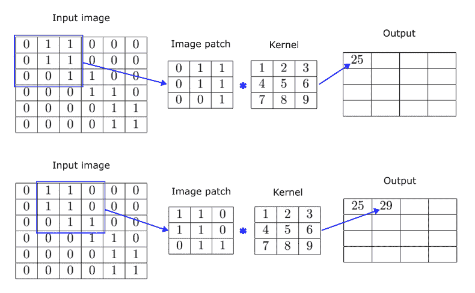
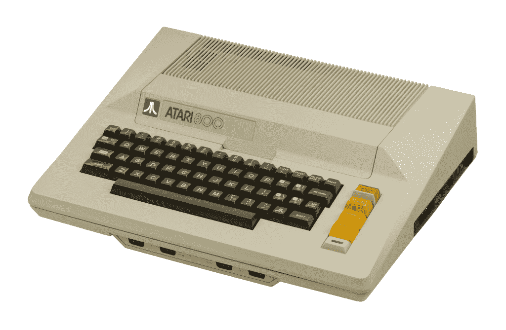
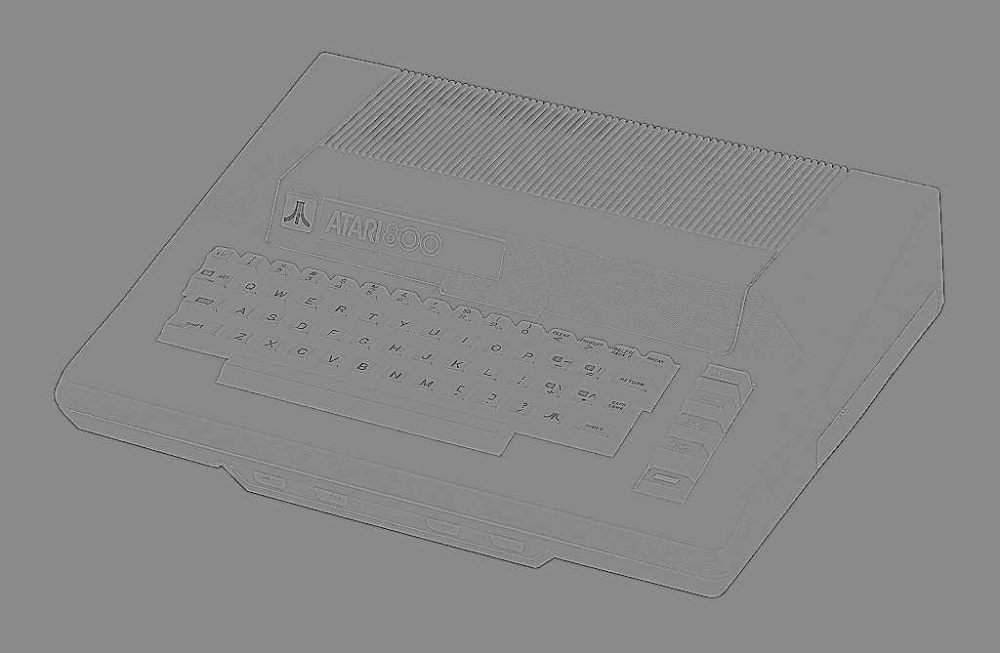
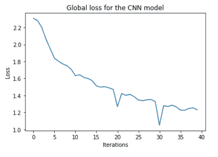

# 基于 PyTorch 的 GPU 加速卷积神经网络

> 原文：<https://www.dominodatalab.com/blog/gpu-accelerated-convolutional-neural-networks-with-pytorch>

卷积神经网络(CNN 和 ConvNets)是一类通常用于图像分类(将图像数据映射到类值)的神经网络。在高层次上，CNN 可以简单地视为前馈网络的变体，但是与用于分析视觉图像的更传统的算法相比，它们具有许多优势。

*   CNN 利用了视觉合成的层次性，从简单的图元开始，将它们组合起来产生越来越复杂的模式。这最终实现了特性选择阶段的自动化，使 ConvNets 比其他依赖手工特性的技术更有优势。
*   作为神经网络，CNN 也受益于可扩展的架构，并且也适合 GPU 加速的训练。这使得它们成为处理大型数据集的好选择。
*   经典的前馈神经网络是完全连接的，这意味着它们计算量很大，并且随着其参数数量的增加，容易过拟合。另一方面，ConvNets 的卷积层和汇集层在将数据馈送到完全连接的层之前减少了原始维度，从而使网络的计算量更小，并且不太可能过度拟合。

## 卷积图像

CNN 的核心是*卷积*——通过对图像的每个像素及其邻居应用内核(另一个矩阵)来转换输入图像(一个矩阵)的过程。从数学的角度来看，卷积运算产生的函数显示了第二个函数如何修改第三个函数。在不涉及数学细节的情况下，使用卷积进行图像处理背后的直觉如下:原始图像被视为矩阵，其中每个元素表示单个像素。这些可以是 0 或 1(对于单色图像)或给定范围内的整数(例如，0-255 表示灰度图像中的强度)。对于彩色图像，我们通常使用多个矩阵，每个通道一个矩阵，事情变得稍微复杂一些，但原理是相同的。

CNN 中的卷积层使用核或滤波器，它只是另一个更小维度的矩阵(例如 3×3、5×5 等)。).内核滑过图像，在相同大小的小块上运行。然后，通过执行逐元素的矩阵乘法并将结果元素加在一起以产生单个标量，来卷积当前面片和内核。这个过程如下图所示。



本例中的内核大小为 3x3，因此我们从原始图像的左上角开始获取一个 3x3 的补丁。图像块和内核被卷积以产生单个标量值- 25。然后，我们将选择滑动到右边，并采用第二个补丁来产生第二个输出元素。我们重复该操作，直到我们用尽原始图像中所有可能的补片。请注意，使用 3x3 的补丁，我们可以在水平方向上做四张幻灯片，在垂直方向上做另外四张幻灯片。因此，在 6x6 图像上应用 3x3 内核的结果是 4x4 输出矩阵。这也展示了卷积如何实现降维，但这通常不是我们减少输出大小所依赖的主要机制。

让我们观察用两个内核卷积随机图像的效果。首先，我们从原始图像开始——漂亮的 Atari 800 8 位家用电脑的照片。



用下面的内核卷积这个图像

| one | one | one |
| one | one | one |
| one | one | one |

导致图像稍微模糊。


这种转变不容易发现，但结果并不总是那么微妙。例如，我们可以用下面的内核对原始图像进行卷积。

| Zero | one | Zero |
| one | -4 | one |
| Zero | one | Zero |

这会产生以下输出图像:



这种变换对于边缘检测非常有用。还要注意，在这种情况下，我们保留了原始图像的尺寸。最简单的方法是在原始图像的边界周围填充零，这样我们就可以得到许多与其原始分辨率相同的补片。我们提到这一点只是为了清楚起见，因为这对于理解图像与内核的卷积并不重要。

现在，如果你后退一步，想想应用滤波器的输出结果，你会意识到你可以把滤波器看作特征检测器。例如，在上面的图像中，我们可以看到每个图像块有多少类似于边缘的东西。通过使用各种只能检测水平或垂直边缘的内核，可以更加精确。你可以使用内核来检测拱门，对角线等等。在图像上滑动图像补丁窗口并使用适当的内核本质上是一种模式检测机制。

## 卷积神经网络的体系结构


既然我们已经了解了卷积是如何被用作 CNN 的构建模块的，那么让我们来讨论一下典型的网络架构是什么样子的。一般来说，CNN 网络具有两个功能上不同的元件，一个负责特征提取，另一个负责基于提取的特征执行分类。

网络的特征提取(或特征学习)部分采用一系列卷积和汇集层。

*   每个**卷积层**应用一个滤波器，它与输入卷积以创建一个激活图。正如我们在上一节中已经展示的，滤波器在图像上滑动(水平和垂直)，并且为每个空间位置计算输出标量。如果图像包含关于颜色的数据，典型的方法是分别处理每个颜色通道，产生张量而不是简单的 2D 矩阵。
*   卷积层通常保持输入的维度。这可能是有问题的，因为相同的特征(例如，边缘或直线)如果出现在图像中的不同位置，会导致不同的特征图。**共享层**是 ConvNets 用来应对这一挑战的。这些图层对影像进行下采样以降低分辨率，同时保留要素地图中存在的要素。

    
    上图显示了一个 max pooling 图层，该图层汇总了 4x4 要素地图中最活跃的要素。您会看到池层将特征地图划分为四个区域，并为每个面片创建一个具有最大值的标量。这是一个所谓的**最大池层** 的例子。还有其他类型的池，例如 **平均池层** 。在这种情况下，池层不是从每个区域中取最大值，而是生成给定区域中所有数字的平均值。

请注意，没有硬性要求成对使用卷积层和池层。例如，在 CNN 架构中，多个卷积层之后是单个 max 池层。其他架构在每个卷积层之后添加 RELU 层，依此类推。
网络的这一部分负责执行实际的分类，其输出数量对应于数据集中的类的数量。输出通常在 softmax 函数之后进行评估，soft max 函数用于将原始分数压缩为加起来等于 1 的标准化值。这是处理分类问题的经典前馈网络的标准配置。

## 一种用于图像分类的简单 CNN

现在我们知道了足够多的理论，让我们看看使用 PyTorch 和 GPU 加速(如果可用的 GPU 硬件可用)训练卷积神经网络的过程。我们从导入我们需要的所有 Python 库开始:

```
import torch
import torchvision
import torchvision.transforms as transforms

import numpy as np
import matplotlib.pyplot as plt

import torch.nn as nn
import torch.nn.functional as F
import torch.optim as optim

import time
```

现在让我们看看 CUDA 是否可用，并为 PyTorch 设置合适的设备，以便我们的网络可以使用它。

```
if torch.cuda.is_available():

  print("CUDA available. Using GPU acceleration.")

  device = "cuda"

else:

  print("CUDA is NOT available. Using CPU for training.")

  device = "cpu"

```

我们现在开始加载数据集并定义 10 个可能的对象类。

```
cifar10 = np.load("/domino/datasets/CIFAR10/cifar10.npz")

X_train = cifar10["X_train"]

y_train = cifar10["y_train"].flatten()

X_test = cifar10["X_test"]

y_test = cifar10["y_test"].flatten()

classes = ("plane", "car", "bird", "cat", "deer", "dog", "frog", "horse", "ship", "truck")

```

现在让我们把所有的图片分成 255，这将把它们从 0-255 重新调整到 0-1。我们还将把它们从整型转换成浮点型，这使得计算更加方便。

```
X_train = X_train.astype("float32") / 255

X_test = X_test.astype("float32") / 255

```

让我们从我们的训练集中挑选出前 10 幅图像，并把它们画出来，这样我们就能知道我们在处理什么了。


最后，我们将当前保存图像的 NumPy 数组转换为 PyTorch 张量，并将它们发送到适当的设备(如果 CUDA 可用，则发送到 GPU，否则发送到普通内存)。

```
X_train = torch.tensor(X_train, device=device).permute(0, 3, 1, 2).float()

y_train = torch.tensor(y_train.flatten(), device=device)

```

这是我们网络的定义。您可以看到，它由两个卷积层、两个池层、一个批量标准化层(用于稳定学习)和三个执行线性变换的全连接层组成。

```
class Net(nn.Module):

    def __init__(self):

        super().__init__()

        self.conv1 = nn.Conv2d(3, 6, 5)

        self.pool = nn.MaxPool2d(2, 2)

        self.conv2 = nn.Conv2d(6, 16, 5)

        self.batch_norm = nn.BatchNorm2d(16)

        self.fc1 = nn.Linear(16 * 5 * 5, 120)

        self.fc2 = nn.Linear(120, 84)

        self.fc3 = nn.Linear(84, 10)

    def forward(self, x):

        x = self.pool(F.relu(self.conv1(x)))

        x = self.pool(F.relu(self.conv2(x)))

        x = self.batch_norm(x)

        x = torch.flatten(x, 1) # flatten all dimensions except batch

        x = F.relu(self.fc1(x))

        x = F.relu(self.fc2(x))

        x = self.fc3(x)

        return x

net = Net()

net.to(device)

```

我们可以绘制训练损失图，并确认它随着训练而减少。

```
fig = plt.figure(figsize=(6,4))

plt.plot(loss_hist)

plt.xlabel("Iterations")

plt.ylabel("Loss")

plt.title("Global loss for the CNN model")

plt.show()

```



现在让我们用一些看不见的数据来测试这个模型。我们将使用保留集进行预测，绘制前十幅图像及其各自的预测标签。

```
outputs = net(torch.tensor(X_test, device=device).permute(0, 3, 1, 2).float())

_, predicted = torch.max(outputs, 1)

fig, ax = plt.subplots(1,10,figsize=(15,2))

for i in range(10):

    ax[i].imshow(X_test[i])

    ax[i].axes.xaxis.set_ticks([])

    ax[i].axes.yaxis.set_ticks([])

    ax[i].title.set_text(classes[predicted[i]])

plt.show()

```


总的来说还不错，考虑到简单的网络架构和我们没有在超参数调优上花费任何时间的事实。

## 摘要

在本文中，我们介绍了卷积神经网络(CNN ),并提供了一些关于它们如何提取特征和降低维数的直觉。CNN 主要用于解决计算机视觉问题，但它们也应用于其他机器学习领域:

*   **推荐系统**——CNN 常用于推荐系统(参见杨等，2019；Krupa 等人，2020)，尤其擅长处理非结构化数据(如视频和图像)。它们是很好的特征提取器，可以帮助缓解冷启动问题。
*   **自然语言处理**-CNN 可用于情感分析和问题分类(Kim，2014)、文本分类(张、赵、乐存，2015)、机器翻译(Gehring et al .，2016)等
*   **时间序列分析**(雷，吴，2020)等

如果您想研究本文中的示例代码，请[注册一个免费的 Domino 帐户](https://invite.try.dominodatalab.com/inds?utm_source=DS_Blog),您将可以立即访问一个笔记本和一个 Python 脚本来进行实验。项目名称为sample-project-2 _ GPU-trained-CNNs，会自动出现在您的项目部分。

## 参考

使用两级 CNN 的情绪感知智能音乐推荐系统。2020 年第三届智能系统和发明技术国际会议(ics it)(2020 年):1322-1327。[https://ieeexplore.ieee.org/document/9214164](https://ieeexplore.ieee.org/document/9214164)

丹阳，张箐，王史风，张学东，“一个时间感知的基于 CNN 的个性化推荐系统”，复杂性，2019 卷，文章 ID 9476981，11 页，2019。[https://doi.org/10.1155/2019/9476981](https://doi.org/10.1155/2019/9476981)

金，尹。2014.用于句子分类的卷积神经网络。[](https://www.aclweb.org/anthology/D14-1181.pdf)。

张，项，赵军波，杨乐存。2015.用于文本分类的字符级卷积网络。[https://papers . nips . cc/paper/5782-character-level-convolutionary-networks-for-text-class ification . pdf](https://papers.nips.cc/paper/5782-character-level-convolutional-networks-for-text-classification.pdf)

乔纳斯·格林，迈克尔·奥利，大卫·格兰吉尔，扬·多芬。2016.一种用于神经机器翻译的卷积编码器模型，[](https://arxiv.org/abs/1611.02344)

雷、、吴。"基于统计特征的时间序列分类."EURASIP 无线通信和网络杂志 2020 (2020): 1-13。[https://www . semantic scholar . org/paper/Time-series-class ification-based-on-statistical-Lei-Wu/529 f 639407 CB 6b 3 b 591 b 69 a 93 de 9 c 7124 c 826 fa 7](https://www.semanticscholar.org/paper/Time-series-classification-based-on-statistical-Lei-Wu/529f639407cb6b3b591b69a93de9c7124c826fa7)