# Python 中 k-means 聚类入门

> 原文：<https://www.dominodatalab.com/blog/getting-started-with-k-means-clustering-in-python>

假设您是一名成功的营销人员，正在为一种产品开展新的营销活动，并希望找到合适的目标细分市场；或者您是一名律师，对根据不同文档的内容对其进行分组感兴趣；或者您正在分析信用卡交易以确定相似的模式。在所有这些情况下，以及更多情况下，数据科学可以用来帮助对数据进行聚类。聚类分析是无监督学习的一个重要领域，它帮助我们将数据分组在一起。我们已经在这个博客中讨论过监督学习和非监督学习的区别。提醒一下，当标记数据不可用于我们的目的，但我们希望探索数据中的共同特征时，我们使用无监督学习。在上面的例子中，作为一名营销人员，我们可能会在目标受众中发现共同的人口统计特征，或者作为一名律师，我们会在相关文档中建立不同的共同主题，或者作为一名欺诈分析师，我们会建立共同的交易，这些交易可能会突出某人账户中的异常值。

在所有这些情况下，聚类都有助于找到那些共同的痕迹，并且有各种各样的聚类算法。在之前的帖子中，我们讨论了基于密度的聚类，其中我们讨论了它在异常检测中的使用，类似于上面的信用卡交易用例。在那篇文章中，我们认为其他算法可能更容易理解和实现，例如 k-means，这篇文章的目的就是要做到这一点。

我们将首先建立一个簇的概念，并确定 k 实现中的一个重要部分——意为:质心。我们将看到 k -means 如何处理相似性问题，以及如何在每次迭代中更新组，直到满足停止条件。我们将通过 Python 实现来说明这一点，并通过查看如何通过 [Scikit-learn 库](https://scikit-learn.org/stable/modules/clustering.html#k-means)来使用该算法来结束。

如果你安装了 Python 3.x，你可以在你自己的机器上使用这篇文章中的代码。或者，您可以注册免费试用 Domino MLOps 平台，并直接访问本文中使用的代码(使用本文末尾的 Access Project 按钮)。让我们开始吧。

## K-Means -什么意思？ 

我们提到过，我们对找出数据观察的共性很感兴趣。确定共性或相似性的一种方法是通过测量数据点之间的距离。距离越短，观察结果越相似。我们可以用不同的方法来测量距离，很多人都很熟悉的一种方法是欧几里德距离。没错！也是我们在学习勾股定理时学到的。让我们看一看并考虑对两个属性\(a\)和\(b\)的两个数据观察。点\(P1 \)有坐标\((a1，B1)\)和点\(p2 =(a2，B2)\)。

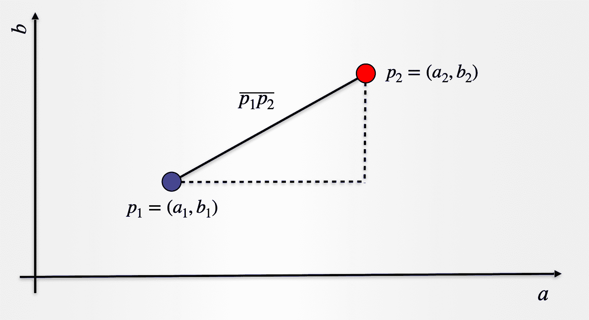

距离\(\overline{p_1 p_2 }\)由下式给出:

$ $ \ overline { p _ 1 p _ 2 } = \ sqrt {(a _ 2-a _ 1 )^2+(b_2-b_1 )^2 } $ $

上面的表达式可以扩展到两个以上的属性，并且可以测量任意两点之间的距离。对于具有\(n\)个观察值的数据集，我们假设有\(k\)个组或聚类，我们的目标是确定哪个观察值对应于这些\(k\)个组中的任何一个。这是需要强调的重要一点:算法不会给我们聚类的数目，相反我们需要预先定义数目\(k\)。我们可以用不同的(k)值来运行算法，并确定最佳的可能解决方案。

简而言之，\(k \)-意味着聚类试图最小化属于一个聚类的观察值之间的距离，并最大化不同聚类之间的距离。通过这种方式，我们在属于一个组的观察值之间有了内聚力，而属于不同组的观察值被进一步分开。请注意，正如我们在[这篇文章](https://www.dominodatalab.com/blog/topology-and-density-based-clustering)中解释的那样，\(k\)-means 是详尽的，因为数据集中的每一个观察值都将被迫成为假设的\(k\)个聚类之一的一部分。

现在应该清楚了\(k\)-means 中的\(k\)来自哪里，但是“means”部分呢？事实证明，作为算法的一部分，我们也在寻找每个聚类的中心。我们称之为*质心*，当我们将观测值分配给一个或另一个星团时，我们更新星团*质心*的位置。这是通过取该聚类中包含的所有数据点的平均值(如果愿意，也可以取平均值)来实现的。轻松点。

## k-means 的配方

\(k\)-means 的方法非常简单。

1.  决定您想要多少个集群，即选择 k
2.  为 k 个簇中的每一个随机分配一个质心
3.  计算所有观测到 k 个质心的距离
4.  将观测值指定给最近的质心
5.  通过取每个聚类中所有观察值的平均值，找到质心的新位置
6.  重复步骤 3-5，直到质心不再改变位置

就这样！

看看下面的示意图，其中以示意的方式描述了二维空间的步骤。相同的步骤可以应用于更多的维度(即更多的特征或属性)。为简单起见，在示意图中我们只显示了到最近质心的距离，但实际上需要考虑所有距离。


## 入门指南

出于实现的目的，为了简单起见，我们将查看一些具有 2 个属性的数据。然后我们将看一个更多维度的例子。为了让我们开始，我们将使用一个我们已经准备好的数据集，它可以在[这里](https://figshare.com/articles/dataset/K_Means_-_Data_Blobs/19102187/3)获得，名称为 kmeans_blobs.csv 。数据集包含 4 列，包含以下信息:

1.  *ID* :观察的唯一标识符
2.  *x*:x 坐标对应的属性
3.  *y*:y 坐标对应的属性
4.  *Cluster* :观察所属的簇的标识符

在我们的分析中，我们将放弃第 4 列，但它可能有助于检查应用\(k\)均值的结果。我们将在后面的第二个例子中这样做。让我们从读取数据集开始:

```
import numpy as np

import pandas as pd 

import matplotlib.pyplot as plt

from matplotlib.colors import ListedColormap

%matplotlib inline

blobs = pd.read_csv('kmeans_blobs.csv')

colnames = list(blobs.columns[1:-1])

blobs.head()

```

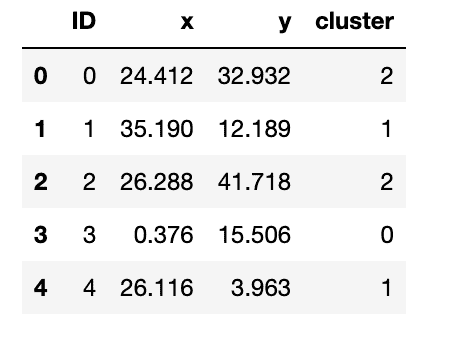

让我们看看数据集中的观察结果。我们将使用 Cluster 列来显示数据集中存在的不同组。我们的目标将是看看该算法的应用是否再现了密切的分组。

```
customcmap = ListedColormap(["crimson", "mediumblue", "darkmagenta"])

fig, ax = plt.subplots(figsize=(8, 6))

plt.scatter(x=blobs['x'], y=blobs['y'], s=150,

            c=blobs['cluster'].astype('category'),

            cmap = customcmap)

ax.set_xlabel(r'x', fontsize=14)

ax.set_ylabel(r'y', fontsize=14)

plt.xticks(fontsize=12)

plt.yticks(fontsize=12)

plt.show()
```

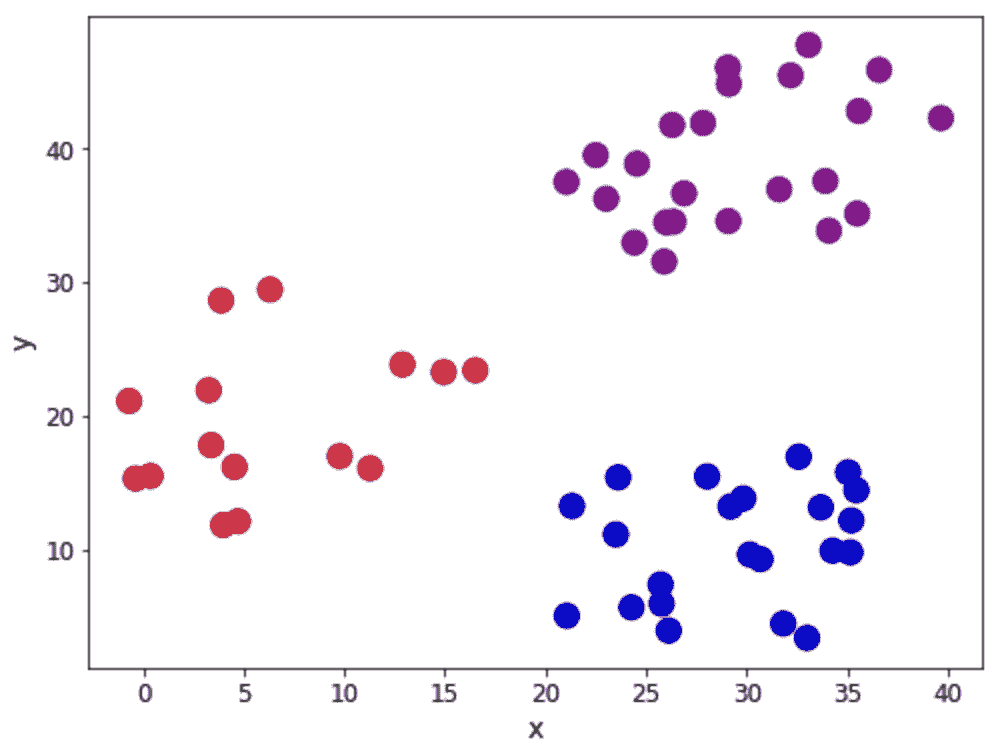

现在让我们看看我们的食谱。

### 步骤 1 和 2 -定义\(k\)并初始化质心

首先，我们需要 1)决定我们有多少组，2)随机分配初始质心。在这种情况下，让我们考虑\(k=3\ ),至于质心，它们必须与数据集本身在同一范围内。因此，一种选择是随机选取\(k\)个观察值，并使用它们的坐标来初始化质心:

```
def initiate_centroids(k, dset):

    '''

    Select k data points as centroids

    k: number of centroids

    dset: pandas dataframe

    '''

    centroids = dset.sample(k)

    return centroids

np.random.seed(42)

k=3

df = blobs[['x','y']]

centroids = initiate_centroids(k, df)

centroids
```

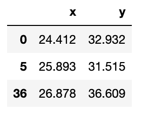

### 第 3 步-计算距离

我们现在需要计算每个质心和数据点之间的距离。我们将把数据点分配给误差最小的质心。让我们创建一个函数来计算平方误差的根:

```
def rsserr(a,b):

    '''

    Calculate the root of sum of squared errors. 

    a and b are numpy arrays

    '''

    return np.square(np.sum((a-b)**2)) 
```

让我们挑选一个数据点并计算误差，这样我们就可以看到它在实践中是如何工作的。我们将使用点 ，它实际上是我们上面选择的质心之一。因此，我们期望该点和第三个质心的误差为零。因此，我们会将该数据点分配给第二个质心。我们来看看:

```
for i, centroid in enumerate(range(centroids.shape[0])):

    err = rsserr(centroids.iloc[centroid,:], df.iloc[36,:])

    print('Error for centroid {0}: {1:.2f}'.format(i, err))
```

```
Error for centroid 0: 384.22

Error for centroid 1: 724.64

Error for centroid 2: 0.00
```

### 步骤 4 -指定质心

我们可以使用步骤 3 中的想法来创建一个函数，帮助我们将数据点分配给相应的质心。我们将计算与每个质心相关的所有误差，然后选择具有最低值的一个进行分配:

```
def centroid_assignation(dset, centroids):

    '''

    Given a dataframe `dset` and a set of `centroids`, we assign each

    data point in `dset` to a centroid. 

    - dset - pandas dataframe with observations

    - centroids - pa das dataframe with centroids

    '''

    k = centroids.shape[0]

    n = dset.shape[0]

    assignation = []

    assign_errors = []

    for obs in range(n):

        # Estimate error

        all_errors = np.array([])

        for centroid in range(k):

            err = rsserr(centroids.iloc[centroid, :], dset.iloc[obs,:])

            all_errors = np.append(all_errors, err)

        # Get the nearest centroid and the error

        nearest_centroid =  np.where(all_errors==np.amin(all_errors))[0].tolist()[0]

        nearest_centroid_error = np.amin(all_errors)

        # Add values to corresponding lists

        assignation.append(nearest_centroid)

        assign_errors.append(nearest_centroid_error)

    return assignation, assign_errors
```

让我们在数据中添加一些列，包含质心分配和产生的误差。此外，我们可以使用它来更新显示质心(用正方形表示)的散点图，并根据它们被分配到的质心对观察值进行着色:

```
df['centroid'], df['error'] = centroid_assignation(df, centroids)

df.head()
```

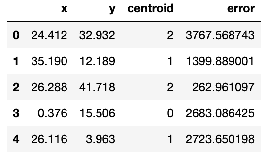

```
fig, ax = plt.subplots(figsize=(8, 6))

plt.scatter(df.iloc[:,0], df.iloc[:,1],  marker = 'o', 

            c=df['centroid'].astype('category'), 

            cmap = customcmap, s=80, alpha=0.5)

plt.scatter(centroids.iloc[:,0], centroids.iloc[:,1],  

            marker = 's', s=200, c=[0, 1, 2], 

            cmap = customcmap)

ax.set_xlabel(r'x', fontsize=14)

ax.set_ylabel(r'y', fontsize=14)

plt.xticks(fontsize=12)

plt.yticks(fontsize=12)

plt.show()
```

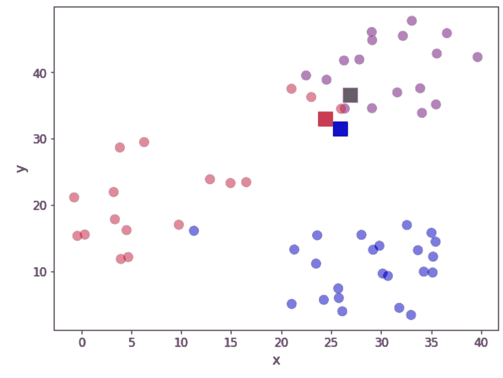

让我们通过将所有贡献相加来看总误差。我们将把这个误差作为收敛的一个度量。换句话说，如果误差不变，我们可以假设质心已经稳定了它们的位置，我们可以终止迭代。在实践中，我们需要注意找到一个局部最小值(超出了本文的范围)。

```
print("The total error is {0:.2f}".format(df['error'].sum()))
```

```
The total error is 11927659.01
```

### 步骤 5 -更新质心位置

现在，我们已经第一次尝试定义我们的簇，我们需要更新 k 质心的位置。我们通过计算分配给每个质心的观测值位置的平均值来实现这一点。让我们看看:

```
centroids = df.groupby('centroid').agg('mean').loc[:, colnames].reset_index(drop = True)

centroids
```

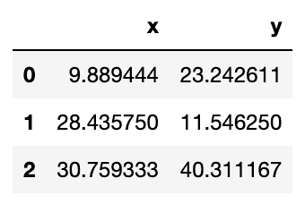

我们可以验证位置是否已经更新。让我们再次看看我们的散点图:

```
fig, ax = plt.subplots(figsize=(8, 6))

plt.scatter(df.iloc[:,0], df.iloc[:,1],  marker = 'o', 

            c=df['centroid'].astype('category'), 

            cmap = customcmap, s=80, alpha=0.5)

plt.scatter(centroids.iloc[:,0], centroids.iloc[:,1],  

            marker = 's', s=200,

            c=[0, 1, 2], cmap = customcmap)

ax.set_xlabel(r'x', fontsize=14)

ax.set_ylabel(r'y', fontsize=14)

plt.xticks(fontsize=12)

plt.yticks(fontsize=12)

plt.show()
```

### 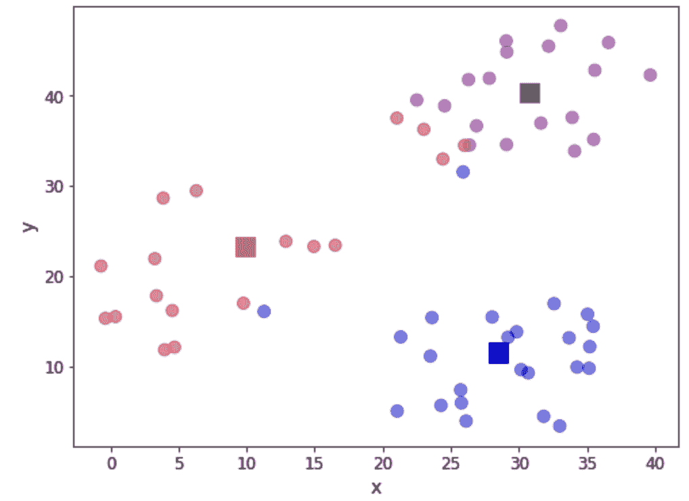步骤 6 -重复步骤 3-5

现在，我们返回来计算到每个质心的距离，分配观察值并更新质心位置。这需要一个函数来封装循环:

```
def kmeans(dset, k=2, tol=1e-4):

    '''

    K-means implementationd for a 

    `dset`:  DataFrame with observations

    `k`: number of clusters, default k=2

    `tol`: tolerance=1E-4

    '''

    # Let us work in a copy, so we don't mess the original

    working_dset = dset.copy()

    # We define some variables to hold the error, the 

    # stopping signal and a counter for the iterations

    err = []

    goahead = True

    j = 0

    # Step 2: Initiate clusters by defining centroids 

    centroids = initiate_centroids(k, dset)

    while(goahead):

        # Step 3 and 4 - Assign centroids and calculate error

        working_dset['centroid'], j_err = centroid_assignation(working_dset, centroids) 

        err.append(sum(j_err))

        # Step 5 - Update centroid position

        centroids = working_dset.groupby('centroid').agg('mean').reset_index(drop = True)

        # Step 6 - Restart the iteration

        if j>0:

            # Is the error less than a tolerance (1E-4)

            if err[j-1]-err[j]<=tol:

                goahead = False

        j+=1

    working_dset['centroid'], j_err = centroid_assignation(working_dset, centroids)

    centroids = working_dset.groupby('centroid').agg('mean').reset_index(drop = True)

    return working_dset['centroid'], j_err, centroids
```

好了，我们现在准备应用我们的函数。我们将首先清理数据集，然后让算法运行:

```
np.random.seed(42)

df['centroid'], df['error'], centroids =  kmeans(df[['x','y']], 3)

df.head()
```

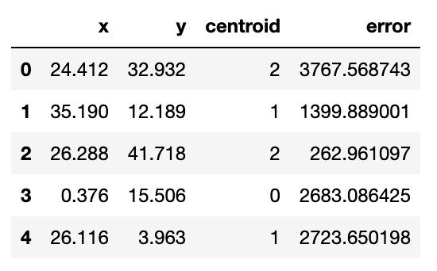

让我们看看最终质心的位置:

```
centroids
```

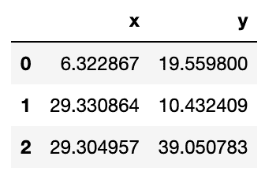

以图形方式，让我们看看我们的集群:

```
fig, ax = plt.subplots(figsize=(8, 6))

plt.scatter(df.iloc[:,0], df.iloc[:,1],  marker = 'o', 

            c=df['centroid'].astype('category'), 

            cmap = customcmap, s=80, alpha=0.5)

plt.scatter(centroids.iloc[:,0], centroids.iloc[:,1],  

            marker = 's', s=200, c=[0, 1, 2], 

            cmap = customcmap)

ax.set_xlabel(r'x', fontsize=14)

ax.set_ylabel(r'y', fontsize=14)

plt.xticks(fontsize=12)

plt.yticks(fontsize=12)

plt.show()
```

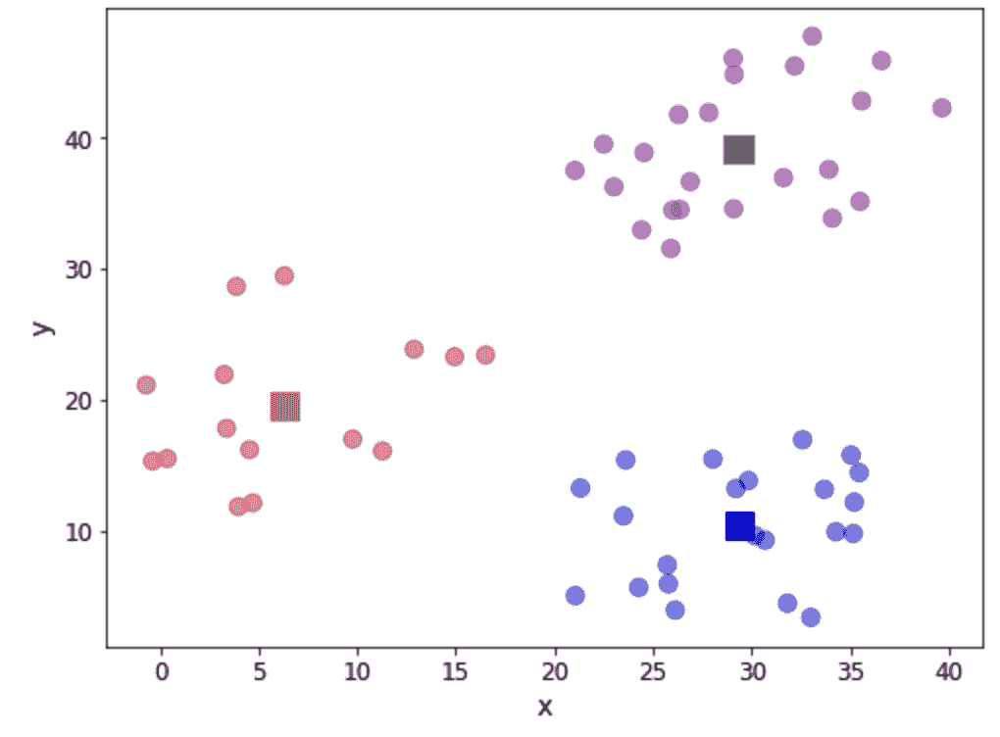正如我们所看到的，已经获得了三个组。在这个具体的例子中，数据表明各组之间的区别是明显的。然而，我们可能不会在所有情况下都这么幸运。所以关于还有多少组织的问题仍然存在。我们可以使用一个屏幕图来帮助我们将误差最小化，方法是查看以序列\(k=1，2，3，4，...\)并在图中寻找指示要使用的群集数量的“弯头”:

```
err_total = []

n = 10

df_elbow = blobs[['x','y']]

for i in range(n):

    _, my_errs, _ = kmeans(df_elbow, i+1)

    err_total.append(sum(my_errs))

fig, ax = plt.subplots(figsize=(8, 6))

plt.plot(range(1,n+1), err_total, linewidth=3, marker='o')

ax.set_xlabel(r'Number of clusters', fontsize=14)

ax.set_ylabel(r'Total error', fontsize=14)

plt.xticks(fontsize=12)

plt.yticks(fontsize=12)

plt.show()
```

我们现在可以应用“肘规则”,这是一种帮助我们确定聚类数量的启发式方法。如果我们认为上面显示的线条描绘的是一只手臂，那么“肘部”就是拐点。在这种情况下，“肘部”位于 2 到 4 个集群之间，这表明选择 3 是一个很好的选择。

## 使用 Scikit-learn

我们已经看到了如何对算法进行初步实现，但在很多情况下，你可能希望站在巨人的肩膀上，使用其他经过尝试和测试的模块来帮助你进行机器学习工作。在这种情况下，Scikit-learn 是一个不错的选择，它有一个非常好的\(k\)-means 实现。如果你想了解更多关于该算法及其评估的信息，你可以看看第 5 章[用 Python 进行数据科学和分析](https://www.taylorfrancis.com/books/mono/10.1201/9780429446641/advanced-data-science-analytics-python-jes%C3%BAs-rogel-salazar)，在那里我使用了一个葡萄酒数据集进行讨论。

在这种情况下，我们将展示如何使用众所周知的 Iris 数据集在几行代码中实现 k-means。我们可以直接从 Scikit-learn 加载它，我们将打乱数据以确保这些点没有按任何特定的顺序列出。

```
from sklearn.cluster import KMeans

from sklearn import datasets

from sklearn.utils import shuffle

# import some data to play with

iris = datasets.load_iris()

X = iris.data 

y = iris.target

names = iris.feature_names

X, y = shuffle(X, y, random_state=42)
```

我们可以调用 KMeans 实现来实例化一个模型并对其进行拟合。参数 *n_clusters* 为聚类数\(k\)。在下面的示例中，我们请求 3 个集群:

```
model = KMeans(n_clusters=3, random_state=42) 

iris_kmeans = model.fit(X)
```

就是这样！我们可以查看算法提供的标签，如下所示:

```
iris_kmeans.labels_
```

```
array([1, 0, 2, 1, 1, 0, 1, 2, 1, 1, 2, 0, 0, 0, 0, 1, 2, 1, 1, 2, 0, 1,

       0, 2, 2, 2, 2, 2, 0, 0, 0, 0, 1, 0, 0, 1, 1, 0, 0, 0, 1, 1, 1, 0,

       0, 1, 1, 2, 1, 2, 1, 2, 1, 0, 2, 1, 0, 0, 0, 1, 1, 0, 0, 0, 1, 0,

       1, 2, 0, 1, 1, 0, 1, 1, 1, 1, 2, 1, 0, 1, 2, 0, 0, 1, 2, 0, 1, 0,

       0, 1, 1, 2, 1, 2, 2, 1, 0, 0, 1, 2, 0, 0, 0, 1, 2, 0, 2, 2, 0, 1,

       1, 1, 1, 2, 0, 2, 1, 2, 1, 1, 1, 0, 1, 1, 0, 1, 2, 2, 0, 1, 2, 2,

       0, 2, 0, 2, 2, 2, 1, 2, 1, 1, 1, 1, 0, 1, 1, 0, 1, 2], dtype=int32)
```

为了进行比较，让我们对标签重新排序:

```
y = np.choose(y, [1, 2, 0]).astype(int)

y
```

```
array([2, 1, 0, 2, 2, 1, 2, 0, 2, 2, 0, 1, 1, 1, 1, 2, 0, 2, 2, 0, 1, 0,

       1, 0, 0, 0, 0, 0, 1, 1, 1, 1, 2, 1, 1, 0, 2, 1, 1, 1, 0, 2, 2, 1,

       1, 2, 0, 0, 2, 0, 2, 0, 2, 1, 0, 2, 1, 1, 1, 2, 0, 1, 1, 1, 2, 1,

       2, 0, 1, 2, 0, 1, 0, 0, 2, 2, 0, 2, 1, 2, 0, 1, 1, 2, 2, 1, 0, 1,

       1, 2, 2, 0, 2, 0, 0, 2, 1, 1, 0, 0, 1, 1, 1, 2, 0, 1, 0, 0, 1, 2,

       2, 0, 2, 0, 1, 0, 2, 0, 2, 2, 2, 1, 2, 2, 1, 2, 0, 0, 1, 2, 0, 0,

       1, 0, 1, 2, 0, 0, 2, 0, 2, 2, 0, 0, 1, 2, 0, 1, 2, 0])
```

我们可以检查有多少观察结果被正确分配。我们在混淆矩阵的帮助下做到这一点:

```
from sklearn.metrics import confusion_matrix

conf_matrix=confusion_matrix(y, iris_kmeans.labels_) 

fig, ax = plt.subplots(figsize=(7.5, 7.5))

ax.matshow(conf_matrix, cmap=plt.cm.Blues, alpha=0.3)

for i in range(conf_matrix.shape[0]):

    for j in range(conf_matrix.shape[1]):

        ax.text(x=j, y=i,s=conf_matrix[i, j], va='center', 

                ha='center', size='xx-large')

plt.xlabel('Predictions', fontsize=18)

plt.ylabel('Actuals', fontsize=18)

plt.title('Confusion Matrix', fontsize=18)

plt.show()
```

正如我们所看到的，大多数观察结果都被正确识别。特别是，群集 1 的那些似乎都已被捕获。

让我们看看最后几个集群的位置:

```
iris_kmeans.cluster_centers_
```

```
array([[5.006     , 3.428     , 1.462     , 0.246     ],

       [5.9016129 , 2.7483871 , 4.39354839, 1.43387097],

       [6.85      , 3.07368421, 5.74210526, 2.07105263]])
```

我们可以看一些 3D 图形。在这种情况下，我们将绘制以下特征:

花瓣宽度
萼片长度
花瓣长度

如您所见，两个图之间有一些颜色不同的观察结果。

```
fig = plt.figure(figsize=(20, 10))

ax1 = fig.add_subplot(1, 2, 1, projection='3d')

ax1.scatter(X[:, 3], X[:, 0], X[:, 2], 

            c=iris_kmeans.labels_.astype(float), 

           edgecolor="k", s=150, cmap=customcmap)

ax1.view_init(20, -50)

ax1.set_xlabel(names[3], fontsize=12)

ax1.set_ylabel(names[0], fontsize=12)

ax1.set_zlabel(names[2], fontsize=12)

ax1.set_title("K-Means Clusters for the Iris Dataset", fontsize=12)

ax2 = fig.add_subplot(1, 2, 2, projection='3d')

for label, name in enumerate(['virginica','setosa','versicolor']):

    ax2.text3D(

        X[y == label, 3].mean(),

        X[y == label, 0].mean(),

        X[y == label, 2].mean() + 2,

        name,

        horizontalalignment="center",

        bbox=dict(alpha=0.2, edgecolor="w", facecolor="w"),

    )

ax2.scatter(X[:, 3], X[:, 0], X[:, 2], 

            c=y, edgecolor="k", s=150, 

            cmap=customcmap)

ax2.view_init(20, -50)

ax2.set_xlabel(names[3], fontsize=12)

ax2.set_ylabel(names[0], fontsize=12)

ax2.set_zlabel(names[2], fontsize=12)

ax2.set_title("Actual Labels for the Iris Dataset", fontsize=12)

fig.show()
```

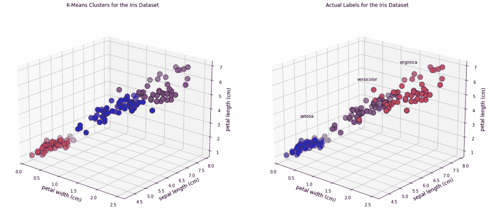

### 摘要

在这篇文章中，我们解释了\(k\)-means 算法背后的思想，并提供了这些思想在 Python 中的简单实现。我希望你同意这是一个非常简单易懂的算法，如果你想使用一个更健壮的实现，Scikit-learn 将为我们提供帮助。考虑到它的简单性，\(k\)-means 是开始聚类分析的一个非常流行的选择。

要访问本文中的代码/数据，请使用下面的 Access Project 按钮。

[](https://cta-redirect.hubspot.com/cta/redirect/6816846/1388f9ba-d43b-477d-9aee-229b2dabaab9)